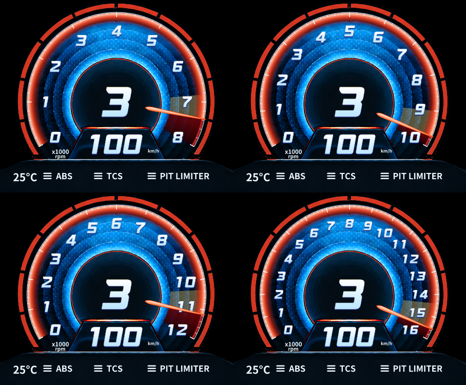
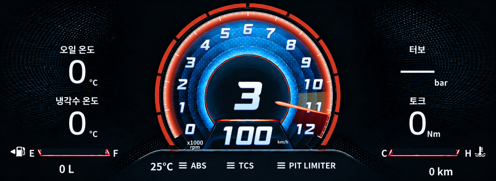

# N 계기판 차량 공통 RPM 경고 정책 — 2026-09-12

## 기준선과 범위

REQ-N-COMMON-RPM-10의 최종 사용자 승인 표시 정책을 구현했다. 이전 프로필·미확인값 fallback 제안은 이 문서로 대체한다. 기존 Monitor 성능 판정 **RED 유지**. 실제 게임 표시와 성능은 이번 실행에서 **NOT TESTED**다.

- 저장소 `E:\AMS2 KRLEAGUE\AMS2KRLeague`, main / v0.7.1, HEAD `85442a7c7b901907623aaecb55f4285d802e7692`. 기존 dirty 작업 보존, commit/tag/push/release 없음.
- 시작 소스 복사본·hash·git 상태·실행 DLL: `C:\Users\User\Documents\Codex\2026-09-08\plugin-computer-use-openai-bundled-play-2\work\rpm-common-policy`의 `before/`, `baseline-hashes.json`, `baseline-status.txt`, `baseline-client.json`. OverlayWindow의 수정 전 복사본 hash까지 포함한 이번 범위는 `source-hashes.json`, 시작점 대비 실제 diff는 `source-changes.diff`.
- 시작 Client DLL SHA256: `2B9C085EF46461F6AE0831B0DCA5D3D7E44244EBAB7D2DE3EED0E5DBE5338220`; Core: `4756FAE315148944159D79EB51619686A223156EF5CAAE3A287752BEFBD44872`.
- 시작 검증: Client157/157, Activity111/111, Release warning/error0. Windows에서 verify.sh가 호출하는 동일 `scripts/verify.ps1`을 직접 실행했다. bash wrapper 자체는 미실행.
- 보호: SHM read-only, 수집/기록/전송 원본과 cadence, 폰트/이미지/안쪽 눈금/중복 배경 제거/retained 렌더 구조. 게임 파일·설치본·사용자 수동 보정은 변경하지 않았다.

## 확정 적용값과 출처

게임 필드는 엔진 최대 RPM인 `mMaxRPM`이며 projection의 `MaxRpm`으로 전달된다. 게임의 노랑/빨강 경계 필드로 취급하지 않는다. 이번 **사용자 승인 표시 정책**은 유효 mMaxRPM의90%를 노랑,97%를 빨강으로 사용한다. 순간 관측 최고 RPM은 사용하지 않는다.

| mMaxRPM | 노랑 시작 | 빨강 시작·점멸·외곽5쌍 완등 | 자동 최대 |
|---:|---:|---:|---:|
|7600|6840|7372|8000|
|10000|9000|9700|10000|
|11500|10350|11155|12000|
|16000|14400|15520|16000|

`maximum=(floor(redStart/1000)+1)*1000`. 노랑은 yellowStart~redStart, 빨강은 redStart~maximum. 경계 RPM은 반올림하지 않는다. 숫자·눈금·바늘·배경에는 기존 공통 Angle 변환을 사용한다. 최대 눈금을 수동으로 높여도 관측 RPM이 redStart 이상이면 외곽5쌍이 완등하고 전체 빨간 영역의 기존200ms 점멸이 시작된다. 표시 바늘 보간이 경고 시작을 늦추지 않도록 경고/완등은 관측 RPM으로 판정한다.

우선순위는 **저장된 유효 차량별 수동 보정 → 유효 mMaxRPM 공통90/97 → 경고 없는 초기 눈금**이다. 내장 차량별 경고 switch와 이전 비율 fallback을 제거했다. 수동값 해제 시 공통값이 설정창에도 즉시 표시된다. 수동 최대와 자동 최대 선택/저장 형식은 유지한다.

기존 Lola B2K00 Ford-Cosworth - Superspeedway에는 최대16000/노랑12333.333333333334/빨강14800 수동 보정이 저장되어 있다. 이를 임의 삭제하지 않았으므로 해당 차량은 해제 전까지 그 값이 우선한다. 다른 미보정 차량은 이름과 무관하게 위 공통 계산을 사용한다.

동일 차량의 일시 무효 mMaxRPM은 마지막 유효 기준을 유지한다. root 이름 또는 실제 viewed participant 차량명이 변경되면 이전 기준과 표시 sample을 제거한다. 새 유효값이 없으면8000 초기 눈금만 사용하고 노랑/빨강/점멸 임계값은 만들지 않는다. 세션 reset 후 새 full snapshot에 유효 기준이 있고 이어지는 fast sample만 무효이면 신선한 snapshot 기준을 보존한다. raw sample 생성단계의 기존 비유한값 차단은 유지했으며, 그 단계에 Infinity 수용 버그가 있었다고 판정하지 않는다.

## 변경 파일

- `src/AMS2LeagueClient.Core/Presentation/AvanteRpmScale.cs`: 공통90/97 resolver, 프로필 우회 제거, 기준 유효성/출처 설명.
- `src/AMS2LeagueClient/Presentation/AvanteClusterView.cs`: 차량 기준 수명, full→fast 전달 보존, 관측 RPM 경고·완등. 공통200ms 위상과 정적/동적 자원 분리는 유지.
- `src/AMS2LeagueClient/Overlay/OverlayWindow.xaml.cs`: 설정창용 엔진 기준도 차량 전환 시 초기화하고 동일 유효성 기준 사용.
- `src/AMS2LeagueClient/Presentation/DrivingHudSettingsWindow.cs`: 기존 수동 보정 해제 시 공통 기본값/출처 갱신.
- `tests/AMS2LeagueClient.Tests/AvanteClusterTests.cs`, `AvanteRpmCalibrationTests.cs`, `Program.cs`: 옛 정책 기대값과 명칭을 새 승인 정책으로 갱신. 기존 geometry/색상 pixel/점멸 양 위상/숫자1~15 확대/수동값 검증 유지.
- 신규 `tests/AMS2LeagueClient.Tests/AvanteCommonRpmPolicyTests.cs`: 네 가지 수치, 양 layout, 경계/수명/수동 해제/원본 값/정적 재생성 회귀1건 추가.
- `PROJECT.md`, `docs/TASK.md`, 통합 보고서의 최신 결과와 본 보고서·WPF 증거를 갱신했다.

## 검증 결과

| 검사 | 시작 | 최종 |
|---|---:|---:|
|Release build 경고/오류|0/0|0/0|
|Client 전체|157/157|158/158|
|Activity 전체|111/111|111/111|
|관련 Avante filter|—|9/9|
|독립 WPF 공통정책 캡처 실행|—|1/1, PNG8개|

검증을 삭제/skip하지 않았다. 신규 테스트1건을 더했다. 개발 중 신규 테스트의 tuple 형식/nullable 생성자 인자 compile 오류를 수정한 후 관련 검사와 최종 전체 gate를 실행했다. 초기41개 compile 오류 로그도 `initial-build-failed.log`로 보존한다. 최종 로그는 `final-verify.log`, 관련 `related.stdout.log`, 캡처 `visual.stdout.log`; repo의 `work/rpm-common-policy/baseline` 및 `final`에도 canonical gate 증거가 있다. scoped diff-check 오류0(기존 파일 CRLF 안내는 build 경고와 별개).

- 각 yellow/red의 직전·동일·직후(±.01RPM),0/최대/초과 입력, 일반/확장 모두 PASS.
- 미등록 차량 및 예전 내장 차량명이 공통값을 덮어쓰지 않음 PASS.
- 같은 차량 null/0/음수/NaN/±Infinity/상한초과 후 유지, 차량명 전환 초기화, 유효값 복구, generation 변경, 새 snapshot→무효 fast sample 전달 PASS.
- 최대20000 수동 보정에서도 빨강11000에서5쌍, 보정 해제 시11500 엔진의10350/11155/12000 복귀 PASS.
- 각 RPM 갱신 전후 `StaticFaceBuilds` 증가0, raw RPM/MaxRpm 불변 PASS. 새 geometry/brush/bounds/stroke 재생성 코드를 매 tick에 추가하지 않았다.
- 기존 WPF 색상 pixel 및 점멸 두 위상 검증 유지/통과. 테스트용 Layout 호출은 캡처/검사에만 존재하며 제품 UpdateLayout 호출은 추가하지 않았다.

실제 WPF 렌더 캡처(합성 입력, physical presentation/FPS 아님): 아래 정상형은 좌상7600, 우상10000, 좌하11500, 우하16000 엔진이며 각 redStart에 바늘을 둔다. 최대8/10/12/16, 분수 경계의 노랑→빨강 전환과 바늘 정렬, 외곽5쌍 완등을 육안 확인했다. 확장형도 같은 좌표다.

모든8개 원본 PNG는 `assets/20260912-common-rpm-policy/`에 있다. 캡처와 제어된 WPF 테스트는 실제 게임 영상의 점멸 수용/물리 화면 부드러움 증명이 아니다.

## 별도 실행본과 한계

- 전환 시각: 2026-09-12T21:21:01.7895692+09:00. 이전 테스트 Client만 정상 창 종료 후 새 테스트 Client 실행.
- 실행 경로: `C:\Users\User\Documents\Codex\2026-09-08\plugin-computer-use-openai-bundled-play-2\work\monitor-rpm\common-rpm-20260912-212101\client\AMS2LeagueClient.exe`.
- Client DLL SHA256: `E8D2FB420AE1AEFD5F5BE8EE83A25AAC5761F604501BB616FE387E862D40DAFB`.
- Core DLL SHA256: `57D7F00422CE2521D6DC940818CA439CDB696D0D132A70EF07BC4EA0F503F2D2`.
- `runtime-proof.json`: PID28144, 실제 경로 일치, Responding=true, 유효 MainWindowHandle, DLL 해시 일치 확인. `--updates-disabled --activity-upload-disabled` 및 별도 activity/log 디렉터리 확인. 실행 성공은 게임/성능 PASS가 아니다.
- 이 수정의 실게임 차량 전환·표시 수용·게임 frame time·CPU/allocation/메모리 교차성능·장시간 수집·VR: **NOT TESTED**. 과거 하네스 개선율을 재사용하지 않았다. 원본 계약 회귀는 자동 검사 통과이며 실제 서버 전송은 실행하지 않았다.
- **최종 판정: 공통 정책 코드·WPF 검증 PASS / 실제 게임·성능 NOT TESTED / 기존 Monitor RED 유지.**
- 다음 작업 한 가지: 다음 실게임 실행에서 수동 보정 없는 두 차량을 전환하며 mMaxRPM/90%/97% 경계와 외곽 완등·점멸을 동시 영상으로 확인한다. 실제 입력 cadence에서의 시각 수용은 이번 합성 검사가 대신할 수 없기 때문이다.
- 사용자 후속 요청에 따라 모든 결과 저장 후 PC 정상 종료를 수행한다. 테스트 Client는 종료 전 정상 종료하며 강제 종료로 기록을 중단하지 않는다. 종료 성공 여부는 종료 뒤 이 프로세스에서 관측할 수 없다.

종료 준비 확인: 2026-09-12T21:24:27.7329439+09:00 별도 테스트 Client PID28144 정상 종료 완료. 증거 normal-close-before-shutdown.json. 사용자 요청에 따른 Windows 정상 종료를 다음 단계에서 호출한다. 강제 앱 종료 옵션은 사용하지 않는다.
