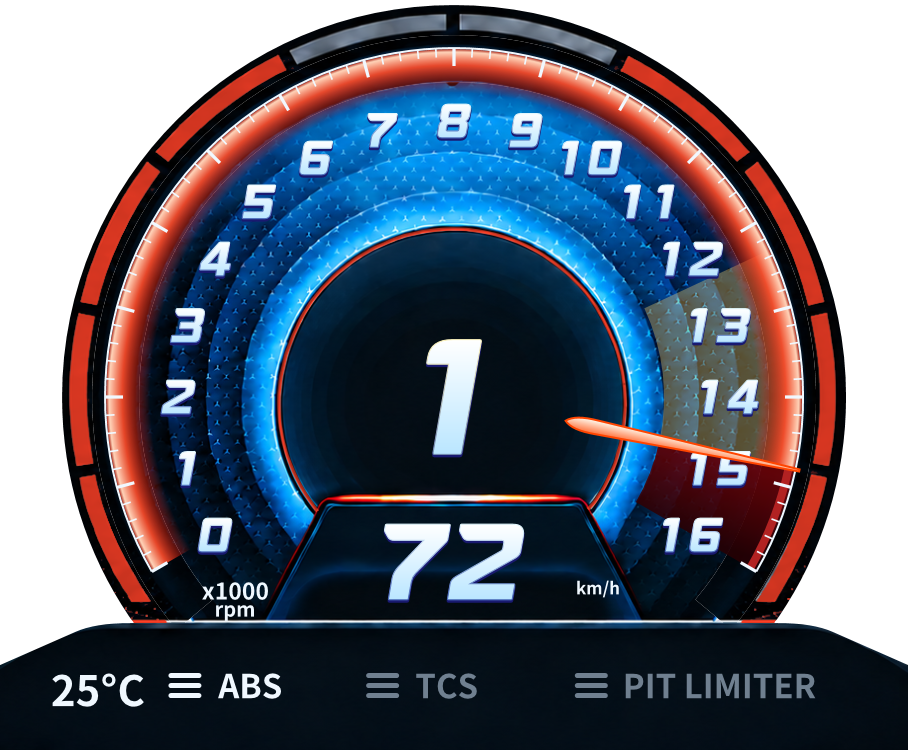
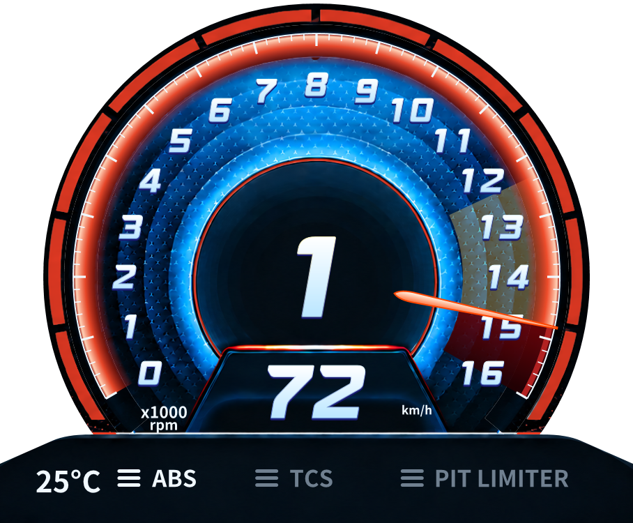
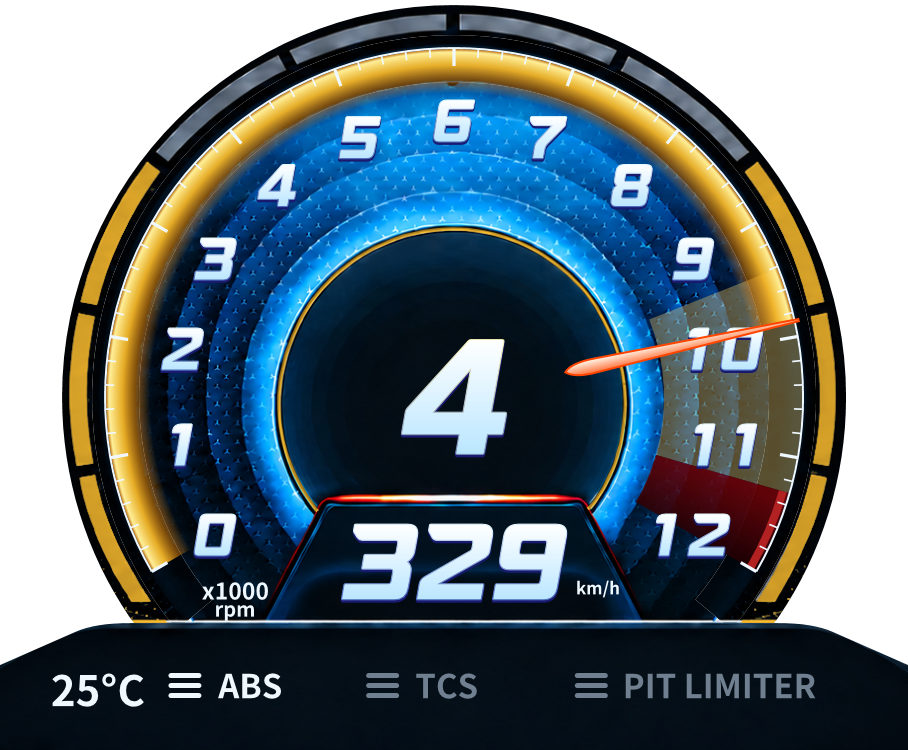

# N 외곽 게이지 완등 / 차량 경고 적용 — 2026-09-12

## 기준선

Base v0.7.1/HEAD85442a7c7b901907623aaecb55f4285d802e7692, Default WPF hardware/Monolith. 직전 blink 실행본 B84A78300FE669834528B92D32FCF3EB01B457B8E2F971CA34D5B1DDBC1FCB50, Core046441CBB638C65DCC08C6D4FAF8DE981A55E6DEA3666DA244B3DE48EB2DBE51. 기존 미커밋 보존. 직전 전체156/156·111/111 검증 로그와 이번 시작 소스/해시/status를 작업 workspace `work/avante-outer-gauge/`에 보존했다. 기준선 게이트를 또 실행하지 않았으며 동일 소스의 직전 결과를 사용했다.

## REQ-N-OUTER-GAUGE-08 DONE (로컬 WPF)

기존 마지막 좌우쌍은 redStart+(Maximum-redStart)/4에서 점등했다. red14800/max16000이면15100에 도달해야 하므로 사용자가 의도한 차량 레드존과 표시 headroom이 결합돼 있었다. 수정 전 WPF에서14800RPM의 마지막 왼쪽 블록은 꺼짐 기준과 pixelDelta0, 새 회귀0/1 기대 실패로 재현했다.

`AvanteRpmScale.LitPairs` 공통 계산에서 알려진 redStart 도달 시5쌍 완등, 노랑~빨강 중간에4쌍, 기존1~3단계 보존. 알려진 경고를 사용하는 모든 차량/사용자 보정에 적용하며 Lola 전용 분기는 없다. 최대 눈금 및 RPM→바늘/눈금/색 경계 변환과200ms 점멸은 변경하지 않았다. 미확인 경고 차량의 흰 범위 진행은 아직 이전 정책이다.

수정 후14800RPM/max16000의 마지막 두 블록은 pixelDelta120/126으로 실제 WPF 점등 확인. red7400/14800와 headroom200/1200/5200에서 완등 기준 불변, 각 경계/음수/NaN/초과값/unknown fallback 검사. RPM만 바꿀 때 정적 face 재생성0.

두 그림은 동일 입력의 합성 WPF 캡처이며 게임/물리 FPS 증거가 아니다.

## REQ-N-VEHICLE-WARNINGS-09 / 전체 차량 요청 PARTIAL

실제 SHM v14 read-only 관측(20:16:21): 현재 RootCarName/VehicleName ARC Camaro, RPM9870.68, mMaxRPM11500. 사용자 게임 HUD 확인은 레드존 약11300, 노란 구간 없음이다. 읽기 스크립트의 최초 문자열 출력에는 NUL 뒤 이전 차량 바이트가 포함됐지만 제품 parser는 첫 NUL에서 종료한다. `live-vehicle.json` 원시 출력과 `live-vehicle-decoded.json` 올바른 식별값을 모두 보존했다. 이 뒤쪽 바이트를 제품의 차량 캐시 오류로 해석하지 않았다.

기존 프로필에는 ARC가 없어서 MaxRPM에서12000 눈금만 만들고 경고 배경을 표시하지 않았다. 고정된 Lola 경고를 재사용한 것이 아니다. 정확한 ARC 이름 프로필에 사용자 확인 빨강 약11300을 추가했고 자동 눈금12000을 적용한다. 노랑9416.667은 기존 N 표시용5/6 대체 규칙이며 게임에 존재하는 값/실측값이 아니다. mMaxRPM11500을11300으로 해석하거나 전차량 레드존으로 간주하지 않았다.

동일 WPF View에서 Lola→ARC 전환, 기존 사용자 보정 우선, 보정 제거 시ARC값11300/12000 복원, 미확인 차량에서 이전 경고 제거, Lola복귀, stale/reset 및 정적 자원 검사를 실행했다. 활성 WPF 창에서 숫자 child13개(0~12)와9870RPM 바늘·노랑/빨강 배경 확인.

초기 테스트 캡처는 분리된 숨김 View에서 변경한 뒤 찍어 이전 retained 숫자가 남아 있었다. 제품은 숨긴 View의 렌더를 미루는 것이 맞으므로 강제 redraw를 제품에 추가하지 않았다. 테스트를 활성 WPF 창으로 바꾸고 실제0~12 렌더를 확인했다. 잘못된 detached 캡처는 `after-captures/arc-camaro-switched-9870.png`, 실제 활성창 캡처는 `after-visible/arc-camaro-switched-9870.png`로 구분한다.

**전체 차량 자동 경고는 아직 완료하지 않았다.** 현재 사용자 보정/확인된 프로필이 우선이고 미확인 차량은 경고가 없다. 사용자에게 엔진 최대RPM을 명시적 추정 경고 기준으로 쓰는 공통 fallback을 허용할지 질문했다. 이전 “mMaxRPM을 레드존으로 간주하지 말 것/75% 삭제” 조건과 충돌하므로 답변 전 해당 기준을 바꾸지 않는다. 프로필을 차량별로 추가하는 것만으로 전체 대응이라고 보고하지 않는다. 노랑은 어떤 선택에서도 게임값으로 보고하지 않는다.

## 변경 파일 / 검증

- 제품: `src/AMS2LeagueClient.Core/Presentation/AvanteRpmScale.cs`의 표시용 계산/ARC프로필만 수정. SHM/parser/Session/Activity/Witness/Compact/Archive/Upload 소스 변경 없음. Core DLL은 이 표시 변경 때문에 해시가 달라졌다.
- 테스트: AvanteClusterTests, AvanteRpmCalibrationTests, Program. 기존156건 유지+외곽 완등1건, 총157건.
- TASK/PROJECT/본 보고서 및 통합 보고서/캡처. 기존 폰트·원본 이미지·AvanteClusterView.cs(점멸/렌더)는 시작 해시와 동일하다.

Release warning0/error0, 전체 Client157/157, Activity111/111. 이후 제품 변경 없이 테스트의 활성 창 전환 검사를 보강하고 해당1/1·WPF 캡처를 재확인했다. 전체 suite를 다시 반복하지 않았다. SHM 수집/기록/전송 cadence·정밀도·계약 변경 없음. 성능/물리 FPS/30분/VR 재측정은 NOT TESTED.

## 실행 / 결론

새 별도 테스트 실행본: `C:\Users\User\Documents\Codex\2026-09-08\plugin-computer-use-openai-bundled-play-2\work\monitor-rpm\outer-gauge-20260912-202656\client\AMS2LeagueClient.exe`
시작:2026-09-12T20:26:58.0671499+09:00,PID19364.
Client SHA256:2B9C085EF46461F6AE0831B0DCA5D3D7E44244EBAB7D2DE3EED0E5DBE5338220
Core SHA256:4756FAE315148944159D79EB51619686A223156EF5CAAE3A287752BEFBD44872

기존 테스트 Client만 정상 종료 후 전환, 게임/설치본 유지. updates-disabled/activity-upload-disabled, 별도 activity/log 경로. 사용자 Lola 수동최대16000 설정 유지. commit/tag/push/release/설치 교체 없음.

외곽 완등 및 확인된 차량 전환의 로컬 WPF 검증 PASS, 실게임 수정 후 수용 NOT TESTED. 이번 전체차량 요청은 **YELLOW/PARTIAL — 추정 fallback 허용 확인 대기**. 기존 Monitor 성능 RED는 바뀌지 않는다.

다음 작업 한 가지: 전체 차량용 미확인값 fallback 정책을 사용자 확인대로 공통 resolver에 반영한다. 확인되지 않은 값을 정확한 게임 경고로 표시하지 않고, 우선순위/차량 전환/무효값/눈금 headroom을 같은 회귀에 추가해야 한다.
