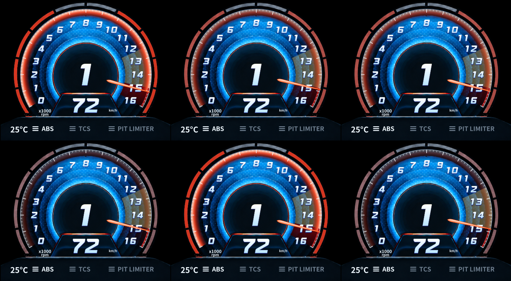

# N 레드존 점멸 영상 확인 / 수정 — 2026-09-12

## 기준선과 실제 관찰

HEAD v0.7.1 `85442a7c7b901907623aaecb55f4285d802e7692`, Default WPF hardware / Monolith. 기존 dirty 및 원본 PNG/폰트 유지. 변경 전 소스/해시/status는 작업 workspace `work/avante-blink/before`, `baseline-hashes.json`, `status-before.txt`. 이전 전체 소스·자산·테스트 실행본 ZIP 백업은 영상 비교 보고서에 기록되어 있다.

현재 영상은 사용자가 촬영한 오버레이 영상이며 현대 원본 계기판 영상과 구분한다. 두 로컬 MP4는 외부 전송 없이 workspace의 ffmpeg로 디코딩했다. 브라우저 file URL 접근은 보안 정책으로 차단되어 우회하지 않았으며, 허용된 로컬 파일 디코딩을 사용했다. 원본 파일 수정 없음.

| 파일 | 길이/인코딩 | SHA256 |
|---|---|---|
| KakaoTalk_20260912_190820955.mp4 | 약2.70초,1080×1920,30fps,HEVC | 5C0CB971FF0C88E6A15B50A4E7A9896744A4AB8DD6657C292339544390C44CA6 |
| KakaoTalk_20260912_191147242.mp4 | 약5.87초,1080×1920,30fps,HEVC | 1209433A3126D79E3C0204A9AC93917945A5B812C3FF06F7F8460D2C23E444B7 |

두 번째 영상176프레임을 순서대로 확인했다. 외곽 빨강이 거의 계속 켜져 있고 간헐적으로만 어두워진다. 첫 어두운 구간은 약0.267~0.333초, 다음 뚜렷한 구간은2.433~2.500초다. 그 사이62개 연속 영상프레임(약2.07초)은 밝은 외곽을 유지한다. 촬영물의 화면 밝기 분석이며 실제 모니터의 물리 presentation FPS 또는 앱 callback 횟수가 아니다.

재현 가능한 보조 분석: 원본을990×900@(0,500)으로 crop,330×300으로 축소한 RGB에서 x5~64/y50~219의 왼쪽 외곽 픽셀 중 R>100, R>1.7G, R>1.4B를 센다. 100개 미만인 뚜렷한 어두운 프레임은10/176개였다. 카메라 움직임·노출·압축 영향이 있으므로 정확한 duty나 원래 RGB로 일반화하지 않는다. 원시 프레임, 연락 시트, `outer-red-count.csv`는 `work/video-reference-FLNtQZ2MWi8/clip-191147/`에 있다.

## 확인된 원인과 수정

기존 `UpdateFlash`는 관측 RPM이 redStart를 조금이라도 내려가면125ms DispatcherTimer를 정지하고 `_flashOn=true`로 초기화한다. 다음 진입에서도 ON부터125ms를 다시 기다린다. 엔진 RPM이 경계를 반복 왕복하면 첫 OFF에 도달하지 못한다. 기존 검사는 일정한 레드존 RPM만 유지했으므로 이 경로를 검출하지 못했다. 영상에서 본 RPM 변화와 부합하지만 영상과 동시 SHM trace가 없으므로 모든 실제 프레임의 원인을 확정했다고 보고하지 않는다.

REQ-N-FLASH-07 수정:

- 짧은 경계 이탈/재진입에서 monotonic elapsed 위상을 보존한다. 그 구간에 별도 timer가 계속 도는 방식이 아니다.
- 기존 공유 Monitor presentation clock을 재사용하고, 기존 Software/VR 표시 경로에는 CompositionTarget.Rendering fallback을 사용한다. 새 스레드/IPC/프로세스 없음.
- 명목250ms(4Hz) 사각 점멸 대신200ms(5Hz), opacity1→0.12→1의 cosine 밝기 전환을 적용한다. 사용자 요청에 따른 더 빠른 주기이며 원본 현대 계기판의 실측 주기라고 주장하지 않는다.
- 기존 바늘/색상의 보간을 유지한다. 점멸은 관측/표시 RPM이 모두 빨강일 때만 적용하고 관측 RPM이 내려가면 즉시 종료한다. 색상 판단을 raw RPM으로 바꿨던 중간 후보는 연속 캡처에서 노랑/빨강 왕복이 드러나 채택하지 않았다.
- flash tick은 기존 follower/외곽·기어 경고/red-zone visual의 opacity만 바꾼다. DrawMotion·정적 face·문자·geometry·bitmap 생성 없음. 기존 공간 방향 그라데이션은 유지했으며 이번 추가는 시간 방향 밝기 전환이다. 새로운 공간 발광층/원본 기어 링의 세부 이식은 미적용이다.
- 숨김/투명/Unloaded/데이터 중단/차량 눈금 변경에서 구독 해제. 숨김·불연속·설정 변경 시 위상 초기화. 수집/기록 원본에는 보간값을 보내지 않는다.

제품 수정은 `AvanteClusterView.cs` 한 파일. 회귀는 `AvanteRpmCalibrationTests.cs`, 등록은 `Program.cs`. 문서 TASK/PROJECT/본 보고서 및 기존 영상/통합 보고서를 갱신했다. `source.diff`는 이번 시작 시점과의 차이만 포함한다.

## 16,000RPM 설정

사용자가14800RPM 차량은16까지 보이도록 요청하여 현재 `Lola B2K00 Ford-Cosworth - Superspeedway`에만 기존 차량별 수동 최대16000을 적용했다. 빨강14800과 노랑12333.3333(기존 명시적5/6 fallback)은 변경하지 않았다. 다른 차량의 자동 최대 정책은 유지한다. 사용자 설정 백업/전후 증거는 `work/video-reference-FLNtQZ2MWi8/lola-16000/`에 있다. 게임 최대값이나 mMaxRPM을 새 redStart로 추정하지 않았다.

## 동일 입력 재현 / 검증

합성 WPF 검사: red14800/max16000, 입력14750↔15100,16ms Dispatcher 요청,1200ms 관측. 실제 callback 간격은 Windows 스케줄링에 따르므로60Hz 수집이라고 표현하지 않는다. profiler 없음. 전체 캡처 실행과 캡처 없는 점멸 재현은 분리했다.

```text
Before: PROOF redline chatter samples=48 dim=0 intermediate=0 bright=48 staticRebuilds=0
After:  PROOF redline chatter samples=49 dim=6 intermediate=12 bright=31 staticRebuilds=0
```

dim<0.25, bright>0.9, 그 사이 intermediate. 이전 DLL의 기대 실패0/1을 보존했다. 수정 후 어두움과 중간 밝기를 실제 WPF visual에서 확인했다. 입력 수는 실행별 scheduling 차이가 있으므로 이 값으로 CPU/FPS 개선율을 계산하지 않는다. staticRebuilds0 유지. 아래는 합성 WPF 연속 캡처이며 실게임 화면이 아니다.



| 검사 | 결과 |
|---|---|
| 최종 Release build | warning0/error0 |
| 최종 Client |156/156, 기존155건 유지+경계 왕복1건 |
| Activity/Compact/Wire 관련 기존 검사 |111/111 |
| 변경 전 계약/Core DLL |046441CBB638C65DCC08C6D4FAF8DE981A55E6DEA3666DA244B3DE48EB2DBE51 유지 |
| ApplyUpdate PS 구문검사 |오류0 |
| 경계 미만 즉시 정지/숨김/중단/투명 |기존 종료 조건 완화 없이 PASS |
| 정적 재생성/이미지 lifetime |기존 검사 및 새 경계 왕복 검사 PASS |
| 실게임 수정 후 점멸/물리 FPS/장시간 자원 |NOT TESTED |
| VR |공용 fallback 코드 보존, REAL VR NOT TESTED |

첫 통합 후보에서는 점멸 종료를 표시 RPM까지 기다리도록 해 기존 즉시 종료 검사가 실패했다(155/156). 이를 테스트에서 완화하지 않고 제품의 즉시 종료를 복구했다. 중간 전체156/156 통과 후 연속 캡처의 색 왕복을 확인해 기존 색상 보간을 보존하고 최종 전체156/156을 다시 확인했다. 각각 `client.*`, `intermediate-client.stdout.log`, `final-client.*` 로그로 남긴다. 최종 verify.ps1의 build/Client/Activity/ApplyUpdate parse 단계는 직접 실행으로 확인했고 wrapper 자체를 다시 실행하지 않았다. 단위/회귀 통과를 실사용 완료로 표현하지 않는다.

## 별도 테스트 실행본 / 판정

실행 경로: `C:\Users\User\Documents\Codex\2026-09-08\plugin-computer-use-openai-bundled-play-2\work\monitor-rpm\blink-20260912-193634\client\AMS2LeagueClient.exe`

Client DLL SHA256: `B84A78300FE669834528B92D32FCF3EB01B457B8E2F971CA34D5B1DDBC1FCB50`.
이전 baseline Client SHA256:61340EDD7F07FC17D6CA8CA4B615CB93457E8DB88EFF9478A9479F2EAAF37B2E.
시작:2026-09-12T19:36:36.7238588+09:00,PID15748. 기존 테스트 Client만 정상 종료, 강제 종료 없음. 업데이트/운영 업로드 비활성, 별도 activity/log 경로. 설치본·게임·원본 자산·commit/tag/push/release 변경 없음.

로컬 재현/수정 검증 PASS. 새 실행본 실게임 시각 수용은 **YELLOW/NOT TESTED**. 기존 전체 Monitor 성능 판정 **RED 유지**. GPU·CPU·allocation/장시간 성능 재측정은 이번 점멸 수정에서 수행하지 않았고 향상으로 주장하지 않는다.

다음 작업 한 가지: 동일 차량으로 새 실행본의 경계 왕복과 고회전 유지 장면을 촬영해 원본/오버레이의 외곽 및 기어 링 밝기 전환을 같은 연속 프레임 방식으로 대조한다. 합성 재현만으로 원본과 같은 품질이라고 확정할 수 없기 때문이다.

실행 후 확인: PID15748 Responding=true, 창 핸들 존재, 실행 경로/해시 일치, updates-disabled/activity-upload-disabled=true, Lola 최대16000/빨강14800/노랑12333.3333 유지. runtime-verification.json 보존. 전체 git diff --check는 기존 AGENTS/TASK의 Markdown 줄바꿈용 공백에서 비정상 종료했으며, 이번 범위 밖 문구/공백은 수정하지 않았다.
