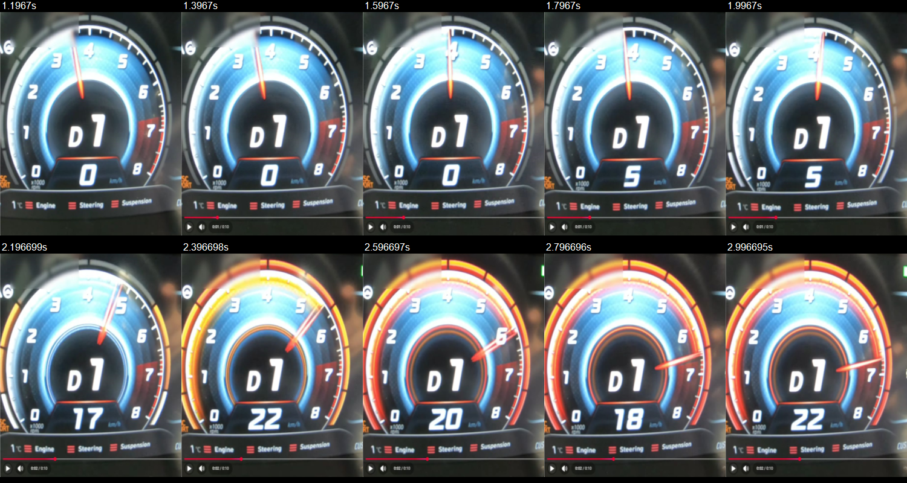
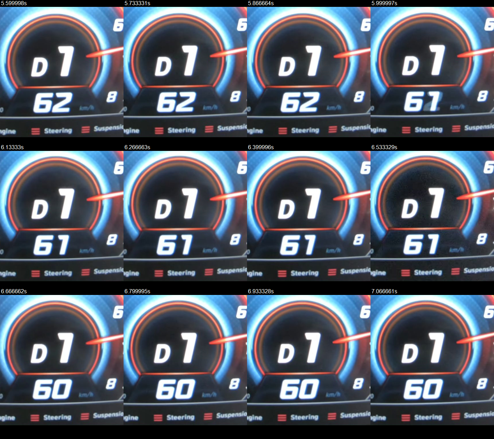
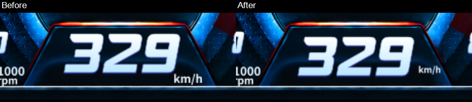
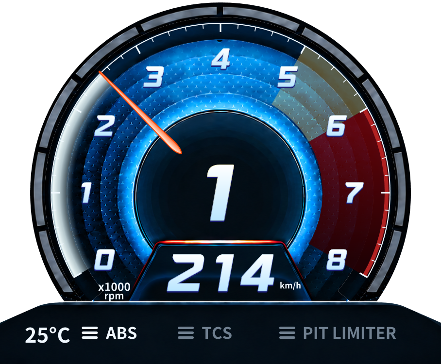
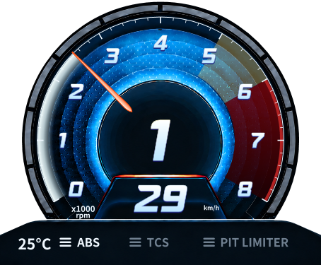

## 2026-09-12 추가 — 레드존 점멸 위상 수정

뒤따른 사용자 영상에서 경계 왕복의 점멸 소실을 재현해 수정했고 별도 실행본으로 전환했다. 최대16000 수동 설정 유지, 최종 Client156/156·Activity111/111·Release warning/error0. 원본과 같은 전체 시각 품질/실게임 수정 후 점멸은 미검증이며 Monitor RED는 유지한다. [실제 영상/원인/최종 수정/실행 해시](2026-09-12-avante-redzone-flash.md). 아래 내용은 이전 단계의 이력이다.

# N 계기판 영상 디테일 검토 및 속도 정렬 — 2026-09-12

## 기준선 / 범위

Base v0.7.1 / HEAD `85442a7c7b901907623aaecb55f4285d802e7692`, Default WPF hardware / Monolith, 기존 dirty 유지.
사용자가 지정한 영상: [파업 선언한 아반떼 N 습식DCT](https://www.youtube.com/shorts/FLNtQZ2MWi8), 약10초. 실제 Chrome 플레이어 재생 및 프레임 탐색으로 확인했다. 자막·썸네일만으로 분석하지 않았다.

변경 전 작업 workspace의 `work/backups/avante-before-video-FLNtQZ2MWi8-20260912-183758/snapshot.zip`에 454개 파일을 보존했다. tracked 및 nonignored untracked 소스, 원본 PNG/폰트, 테스트/보고서, 현재 별도 테스트 Client, 원본 HTML 포함. ZIP CRC, 파일별 SHA256, 원본 재독 및 Git status 동일 검사를 통과했다. `.git`, ignored work/build/log, 설치본, 활성 수집 데이터와 사용자 설정은 포함하지 않는다. 설치본 변경 없음.

백업 ZIP SHA256: `ce19b002aaef97a86f1c2ead58ac5f6bfe4ef8d20a576e9c0623fdf1f1e9fdeb`.

이번 변경은 사용자 추가 요청인 속도 정렬·km/h 크기에 한정했다. 그라데이션/외곽 게이지/기어 링은 아래 개선 후보를 정리했으며 제품 코드는 아직 바꾸지 않았다.

## 영상에서 확인한 디테일 / 개선 후보

| 부분 | 실제 영상 관찰 | 현재 코드와 차이 | 다음 적용 후보 |
|---|---|---|---|
| 바늘 진행 그라데이션 | 저회전에서 밝은 외곽과 안쪽으로 흐려지는 띠가 보이고 바늘 뒤로 진행 영역이 채워진다. 경고 진입 시 노랑·주황·붉은색 계열로 바뀌어도 밝은 외곽이 구분된다. | `DrawMotion`은 r304~348의 유지되는 PathGeometry와 5개 radial stop을 사용한다. 각도 방향의 농도 변화나 끝단 feather는 없으며 끝은 직선이다. | 외곽의 밝은 좁은 띠, 안쪽 투명 감쇠, 바늘 쪽 끝단의 부드러운 연결을 분리해 비교. 단순 불투명 채움이나 전체 blur로 질감을 지우지 않는다. 각도 방향의 추가 감쇠는 영상에서 더 확인해야 하며 확정 사양이 아니다. |
| 외곽 분할 게이지 | 경고 상태에서 각 블록의 밝은 황색/주황 중심과 붉은 가장자리, 블록 사이의 어두운 간격이 함께 보인다. 저회전의 회색 블록과 밝기 대비가 크다. | `CreateWarningLights`가 원본 중성색 픽셀을 색 하나로 치환하고 밝기를0.65~1로 압축한다. 입체적인 밝기 차이가 작아지고, `_motion.Opacity` 하나로 전체 선택 영역이 점멸한다. | 원본 블록 윤곽·간격 유지, 밝은 중심/색 있는 몸체/약한 주변 발광을 최초 생성한 mask로 분리. 표시 중에는 기존 pair clip과 opacity만 갱신. |
| 기어 원 테두리 | 밝은 청색 외곽은 남아 있고, 경고 진입 후 얇은 따뜻한 색 경계와 그 안쪽의 흐린 띠가 함께 보인다. 고회전 연속 프레임에서도 두 띠가 관찰된다. | 현재 코드는 원본 chrome ridge 부근 약4px 폭을 재색칠한다. 안쪽으로 퍼지는 별도 띠는 없고 색/투명도만 변경된다. | 고정 윤곽선과 안쪽 잔광을 별도 retained layer로 분리. 숫자와 속도판을 침범하지 않게 clip 유지. 잔광의 실제 이동/주기/phase는 아직 확정하지 않는다. |

프레임 표기의 시각은 브라우저 media currentTime이다. 저장 구간은 약1.20~3.00초 및5.60~7.07초이며, 각 탐색 후 정지 화면을 캡처했다. 카메라 움직임/노출, 영상 압축, 초점 흐림과 좌상단 모자이크가 섞여 있으므로 화면 색의 절대값·blur 크기를 차량 원본 수치라고 확정하지 않는다. 특히 런치 컨트롤과 NGS 표시가 있는 장면이다. 일반 주행의 RPM 임계값/전체 점멸 duty/125ms 주기/안쪽 띠의 연속 이동을 이 영상만으로 확정하지 않았다. 원본에 없는 회전 애니메이션을 임의로 추가하지 않는다.

## REQ-N-VIDEO-SPEED-06 — 적용한 수정

사용자의 좌측 오버레이214 / 우측 원본29 비교를 기준으로 기존 고정 offset을 수정했다.

- 숫자 중심: `(1028,556)` → `(1024,562)` design 좌표. 우측4px 보정을 제거하고 표시판 상단 약501~하단623 사이의 중심으로 내렸다. 실제 확대 캡처에서 상하 여백과 좌우 중심을 함께 확인했다.
- 숫자 폰트108, 기울기, 고정 digit advance/높이 및 문자 cache는 유지했다. 1·2·3자리별 크기를 줄이지 않는다.
- `km/h`: font22 →17(약23%축소), 중심 `(1157,607)` → `(1168,589)`. 숫자와 겹치지 않는 오른쪽 위치에서 하단 테두리와 간격 확보. 원래 UI 폰트는 유지했다.
- 변경 없는 speed 문자열의 retained layer를 재생성하지 않는 경로는 그대로다. 원본 PNG/폰트, RPM 정책, 기록/전송/수집 cadence 변경 없음.

Before 그림은 변경 전 같은 중심값을 사용한 기존 WPF329 캡처이다. After는 이번 빌드의 실제 WPF 캡처이며 게임 캡처라고 표현하지 않는다. 사용자 제공 영상29는 카메라 원근이 있어 화면 픽셀을 일대일 비교하지 않는다.

## 변경 파일

- `src/AMS2LeagueClient/Presentation/AvanteClusterView.cs`: speed/단위의 위치와 단위 크기만 변경.
- `tests/AMS2LeagueClient.Tests/AvanteClusterTests.cs`: 기존 중심·고정높이 검사의 요구 좌표 갱신,29/214 및0.5/1.5/2배 캡처 추가. 기존 검사 삭제/skip 없음.
- `docs/TASK.md`, `PROJECT.md`, 본 보고서, 통합 보고서와 비교 캡처.

## 검증 / 실패도 보존

| 구분 | 결과 |
|---|---|
| 수정 전 verify.ps1 | Release warning/error0, Client155/155, Activity111/111 |
| 수정 후 Release build | warning/error0 |
| 속도 WPF 캡처 검사 | 1/1,0~9/29/33/100/101/111/113/123/214/329/888. 기본 및0.5/1.5/2배 캡처. 숫자 높이79.05005 design px 유지 |
| 최종 Client 전체 | 155/155, stderr 없음 |
| 최종 Activity 전체 | 111/111 |
| 기존 반복 자원 검사 | 동일표시500회 allocated192000bytes, pixelsStable=true. RPM 변경 시 정적 face 재생성0. 전체 CPU/FPS 증거는 아님 |
| SHM/Activity/Witness/Compact/Archive/Upload | 제품 Core DLL SHA256 동일. 해당 기존 계약 검사를 포함한 Client/Activity 전체 통과 |
| 실제 게임에서 새 정렬 확인 | NOT TESTED — 별도 테스트 실행본을 제공하되 사용자 화면 수용은 남음 |
| 실제 FPS/장시간 자원/VR | 이번에 측정하지 않음. 기존 Monitor RED를 변경하지 않음 |

최초 수정 후 verify.ps1은 기존 `Race batch uploads after whole-field finish and preserves late joins` 검사에서 한 번 실패했다. PowerShell의 Stop/NativeCommandError 처리로 첫 FAIL 줄에서 wrapper가 중단되어 상세 assert가 남지 않았다. 단독 재현1/1 및 오류 스트림을 분리한 전체 재실행155/155는 통과했다. 최초 실패 원인은 확정하지 않았고, 검사/수집 코드를 완화하거나 바꾸지 않았다. 첫 로그는 `final.log`, 단독은 `race-batch-retry.*.log`, 전체는 `client-final.*.log`로 보존했다. Activity 직접 호출에서 잘못된 net8.0 경로를 한 번 지정한 실행 오류도 보존하고 실제 net8.0-windows 경로로111/111을 확인했다. 따라서 wrapper 첫 실행의 실패를 PASS로 덮어쓰지 않는다.

원시 증거는 작업 workspace `work/video-reference-FLNtQZ2MWi8/`, 빌드/초기 gate 로그는 repository `work/video-reference-20260912/`에 있다. 두 work 폴더의 루트는 다르다.

Client DLL before: `006E8FEC193F310AFD7381470A059EB354CB63B4275A54F6ED8712D836DC8380`.
Client DLL after: `61340EDD7F07FC17D6CA8CA4B615CB93457E8DB88EFF9478A9479F2EAAF37B2E`.
Core DLL before/after: `046441CBB638C65DCC08C6D4FAF8DE981A55E6DEA3666DA244B3DE48EB2DBE51`.

## 판정 / 다음 작업

속도 정렬의 로컬 WPF 검증 PASS, 실게임 시각 수용 NOT TESTED. 세 효과의 영상 검토 DONE / 개선 구현 NOT APPLIED. 이번 시각 작업 수용은 YELLOW, 기존 전체 Monitor 성능 RED 유지. 새로운 물리60fps나 실게임 성능 개선 주장은 없다.

다음 작업 한 가지: 세 효과를 동일 RPM 시간열로 기존본과 비교하는 시각 후보를 만들고, 밝은 외곽·블록의 발광층·기어 안쪽 잔광을 한 묶음으로 검증한다. 색 임계값·RPM 정책은 유지하고, 매 프레임 bitmap/geometry 생성 없이 기존 retained 경로에서 비교해야 한다. 이 영상만으로 확인되지 않은 점멸 phase나 회전을 확정하지 않는다.

commit/tag/push/release/설치 교체 없음. 운영 서버 업로드 없음.

## 별도 실행본 준비 / 전환 상태

작업 workspace의 work/monitor-rpm/video-speed-20260912-190107/client에 검증 DLL과 의존 파일을 복사했다. 상태 PREPARED_NOT_STARTED. 기존 Client 종료 후 새 버전 실행 요청은 자동 승인 검토에서 현재 Client를 계속 실행해야 한다는 제한과 충돌한다는 이유로 거절되어 실행하지 않았다. 기존 실행본과 게임은 이 작업에서 종료하지 않았다. 사용자에게 테스트 Client만 정상 종료하여 전환할지 확인을 요청했으며, 승인 전에는 설치/실행 전환을 하지 않는다. candidate.json에 새 DLL 해시를 보존했다.

### 사용자 승인 후 전환 완료 (19:02)

사용자가 "새 테스트 실행본으로 전환"을 명시적으로 승인한 후, 기존 테스트 Client만 정상 종료하여 같은 준비 폴더의 실행본으로 전환했다. 새 PID23416, 시작19:02:30, 창 제목 AMS2 리그 오버레이0.7.1, Responding=true, MainWindowHandle8658802 확인. 실행 DLL은 위 after 해시와 동일하다. `--updates-disabled --activity-upload-disabled` 및 분리된 activity/log 폴더 인자도 프로세스에서 확인했다. 이전 PID27912는 종료됐다. 설치본/게임은 조작하지 않았다. 실행 전환 완료는 실게임 정렬 수용이나 FPS 판정을 의미하지 않는다.

추가 정적 검사: VERSION CHECK PASS(0.7.1), SECRET CHECK PASS(scanned384, allowed37, hits0). 관련 로그와 interactive-after.json은 작업 workspace의 영상 검토 증거 폴더에 보존했다.
