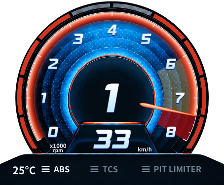
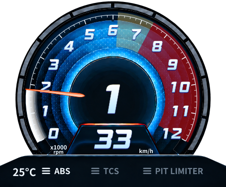
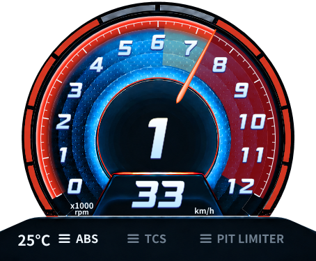

# 최신 결과 — 최종 승인 공통 RPM90/97 정책

내장 경고 프로필을 제거하고 모든 미보정 차량에 mMaxRPM90% 노랑/97% 빨강·200ms 점멸·외곽5쌍 완등을 적용했다. 저장된 수동 보정 우선/해제 시 공통 복귀, 차량 기준 수명과 일반·확장 WPF 검증. Client158/158·Activity111/111·Release warning/error0. 실제 게임/성능 NOT TESTED, 기존 Monitor RED 유지. 아래 이전 정책은 이력이며 최신 승인 정책이 우선한다. [보고서](2026-09-12-avante-common-rpm-policy.md).

## 추가 — 외곽 완등 / ARC 경고 / 전체차량 정책 대기

공통 외곽 완등 수정과 ARC11300/12000 프로필 반영, Client157/157·Activity111/111·warning/error0. 전체 차량 미확인 경고 fallback은 허용 확인 대기. [변경·검증·한계](2026-09-12-avante-outer-gauge-and-vehicle-warning.md). 실게임 수용 미검증, Monitor RED 유지.

## 2026-09-12 추가 — 레드존 점멸 위상 수정

뒤따른 사용자 영상에서 경계 왕복의 점멸 소실을 재현해 수정했고 별도 실행본으로 전환했다. 최대16000 수동 설정 유지, 최종 Client156/156·Activity111/111·Release warning/error0. 원본과 같은 전체 시각 품질/실게임 수정 후 점멸은 미검증이며 Monitor RED는 유지한다. [실제 영상/원인/최종 수정/실행 해시](2026-09-12-avante-redzone-flash.md). 아래 내용은 이전 단계의 이력이다.

# 최신 결과 — 영상 디테일 검토 / 속도 표시 정렬

FLNtQZ2MWi8 실제 프레임 비교, 수정 전454개 소스·자산·별도 실행본 백업/SHA256 검증. 세 효과는 개선 후보 보고만. 속도 중심(1024,562), km/h17/(1168,589) 적용, 숫자 크기/원본 자산/렌더 구조 유지. Release warning/error0, 최종Client155/155·Activity111/111. 최초Race batch 실패/단독 및 전체 재확인 내역 보존. 실게임 정렬 수용 NOT TESTED, Monitor RED 유지. docs/reports/2026-09-12-avante-video-detail-review.md 참조.

# 최신 수정 — 경고 복구 / 중간 숫자 확대 / 원본 정렬 (2026-09-12 18:29)

## 원인과 수정

REQ-N-WARNINGS-RESTORE-03: 앞선 75% 삭제에서 미확인 차량의 경고 경로를 모두 차단해 실제 Lola의 노랑/빨강 배경과 점멸까지 사라졌다. 사용자가 제공한 참조 차량에 프로필을 연결하지 않은 것이 제품 회귀 원인이다. **75% 추정은 복원하지 않았다.** 정확한 참가자 차량 이름으로 다음 참조를 연결했다.

| 차량 | 빨강 시작 | 자동 최대 | 노랑 시작 / 출처 |
|---|---:|---:|---|
| Lola B2K00 Ford-Cosworth - Superspeedway | 약14800 |15000|약12333.333 / 기존 N 빨강5/6 대체값|
| Iveco Stralis |약3800|4000|약3166.667 / 같은 대체값|
| 기존 Aston Martin Vantage GT3 Evo - Low Downforce |약7400|8000|약6166.667 / 기존 대체값 유지|

빨강은 사용자의 해당 차량 HUD 참조를 사용한 근사값이며 노랑은 **실차량 실측값이 아니다**. 설정창 출처 문자열이 실제 적용 값으로 갱신된다. 사용자 보정 우선/수동 최대값/자동 최대의 다음1000 정책 유지. mMaxRPM을 모든 차량의 레드존으로 간주하지 않았다. 현재 SHM read-only에서 Lola 정확 이름과 engineMaximum14800을 확인했지만, 필드 의미는 엔진 최대이며 별도 HUD 빨강/노랑 필드는 없다. 이 관측만으로 모든 차량을 일반화하지 않는다. 미등록 차량 전체의 경고 복구는 아직 완료가 아니며 사용자 보정 또는 추가 확인 프로필이 필요하다.

REQ-N-NUMERALS-04: 한 표시 프레임의 RPM만 평가하므로 3800→4200처럼 ±100RPM 구간을 건너뛰면 중간 숫자의 확대가 아예 생성되지 않는 경로를 재현했다. 빠른 통과 시 해당 숫자가120%로 확대된 후100ms 동안 복귀하도록 보완했다. 느린 통과는3900/3950/4000/4050/4100→100/110/120/110/100% 유지. 같은 retained 숫자 transform과 기존 HudTargetMotion/공유 표시 시계를 사용한다. 새 per-sample Animation/geometry 생성 없음. 가장 최근 통과 숫자1개만 짧게 유지하며 끊긴 입력/숨김에서는 원복한다. 1~15 전체 빠른 통과 검사 PASS. 사용자가 본 현상의 실게임 프레임별 귀속은 아직 NOT TESTED다.

REQ-N-ALIGNMENT-05:
- 원본과 비교해 **흰 외곽선·흰 눈금 안쪽 붉은 띠**로 수정했다. 이전의 빨간 외곽선/빨간 tick을 제거하고, redStart~maximum에 안쪽338~346 띠를 배치한다. 기존 r349/주·보조눈금 위치 유지.
- 기어 발광선의 좁은 원형 clip/색상 필터가 원본 chrome를 부분적으로 남기거나 잘랐다. 원본 픽셀의 국소 밝기 윤곽을 최초 bitmap 생성 시 추적·평활화하고 그 윤곽에 경고색을 적용한다. 원본 곡선의 비대칭과 아래 접점을 따르며 원본 PNG는 수정하지 않았다. 기존 cached bitmap5개 유지, 프레임마다 이미지 처리 없음.
- 속도 숫자 광학 중심을1024,564→1028,556으로 보정(오른쪽4/위8 design px). 폰트108/기울기/동일 digit advance·height 유지. 0~9,10,11,33,100,101,111,113,123,329,888 검사 및 WPF 캡처.

## 기준선 / 검증 / 범위

- 기준선: 바로 앞 소스 사본과 실행본 보존. Client154/154, Activity111/111.
- 최종 Release build warning0/error0. Client **155/155**, Activity **111/111**. 기존154건 유지, 복구 검사1건 추가.
- 새로운 검사는 현재 차량 프로필의 두 배경 픽셀, 경계 전후 band, 점멸 두 phase 및 숨김 정지, 사용자 보정 우선/차량 전환/데이터 중단을 검사한다. 1~15 빠른 통과에서 모두120% 및 감쇠/초기화 PASS.
- 기존 느린 숫자 보간·정적 rebuild0·고정 digit 검증 유지. 동일sample500회 할당192000bytes, 픽셀 안정 유지. 전체 CPU/GPU/메모리 또는 physical FPS 개선을 뜻하지 않는다.
- 버전/secrets PASS. Client/Activity의 Compact/Wire 기존 계약 회귀 PASS. 수집·기록·전송 코드/cadence 변경 없음.
- 최종 로그: work/redzone-restore-20260912/final-aligned.log 및 final-aligned/build.log,client.log,activity.log. 캡처: aligned/. source/DLL 해시: manifest.json.
- 제품 변경: AvanteRpmScale.cs, AvanteClusterView.cs. 테스트: AvanteRpmCalibrationTests.cs, AvanteClusterTests.cs, Program.cs. 문서/증거 추가 외 범위 확대 없음.
- 초기 픽셀 검사는 반투명 노랑에 단색RGB 조건을 사용해 실패했다. 원본 배경과의 실제 채널 차이 검사로 수정. 닫힌 창에서 떼어낸 view의 이전 static 화면을 재사용한 캡처 fixture도 수정했다. C#8 nullable 조건식 컴파일 오류1건 수정. 실패 로그는 남겨두었다.
- 추가 사용자 정렬 요청 전155/111 gate1회 PASS 후, 그 요청까지 반영한 최종 소스에서155/111 재검증. 미세 패치별 전체 테스트를 반복한 것은 아니다.

## 화면

[현재 Lola 13371RPM / 15k범위](assets/2026-09-12-avante-rpm/warning-restored-restored-14800-reference.png)
[점멸 ON](assets/2026-09-12-avante-rpm/warning-restored-restored-14800-flash-True.png) / [점멸 OFF](assets/2026-09-12-avante-rpm/warning-restored-restored-14800-flash-False.png)
[중간4 확대](assets/2026-09-12-avante-rpm/warning-restored-crossed-numeral-4.png) / [10 확대](assets/2026-09-12-avante-rpm/warning-restored-crossed-numeral-10.png)
[속도329 정렬](assets/2026-09-12-avante-rpm/warning-restored-speed-centered-329.png)
[앞서 첨부한 Iveco](assets/2026-09-12-avante-rpm/warning-restored-restored-3800-reference.png)

이것은 실제 WPF 렌더러에 참조 입력을 넣은 캡처다. 실제 게임 화면과 동시 촬영한 것으로 보고하지 않는다.

## 실행 / 남은 제한

별도 테스트 Client를 정상 종료 후 작업공간 work/monitor-rpm/interactive-20260912-182840/client에서 새로 실행. 자동 업데이트/운영 업로드 비활성화, 별도 activity/log 디렉터리 유지. 게임/설치본은 교체·종료하지 않았다.
Client DLL SHA256 006E8FEC193F310AFD7381470A059EB354CB63B4275A54F6ED8712D836DC8380
Core DLL SHA256 046441CBB638C65DCC08C6D4FAF8DE981A55E6DEA3666DA244B3DE48EB2DBE51

코드/WPF 회귀 PASS. 실제 게임에서의 최종 시각 일치·숫자 통과 영상/physical FPS는 NOT TESTED. VR 실기기 NOT TESTED. 기존 전체 Monitor 성능 RED 판정은 유지한다.
다음 한 가지: 현재 차량에서 새 테스트 실행본의 실제 숫자 통과·경고 점멸을 동시에 관찰해 WPF 합성 재현과 실게임 시각 결과를 대조한다.
설치/commit/tag/push/release 없음.

---

# 최신 추가 수정 — 75% 추정 제거 및 N 원본 동작 (2026-09-12 17:49)

이 절이 아래의 **미확인 차량 75% fallback 유지** 설명을 대체한다. 기존 dirty 및 원본 자산 보존, Default WPF hardware/Monolith 유지. 설치/commit/tag/push/release 없음.

## REQ-N-REFERENCE-02 — 구현 및 원인

- **75% 제거:** AvanteRpmScale.Resolve의 engine*.75 및 View의 별도 비율 판정 함수를 제거했다. 미확인 경고값은 표시 모델 내부 PositiveInfinity와 HasWarningThresholds로 구분해 경고 배경·색상·점멸을 차단한다. SHM/기록/전송/JSON에 Infinity를 저장하지 않는다. 설정창은 미확인 경고를 빈칸으로 표시하며 기존 검증을 유지한다.
- 미확인 차량은 엔진 최대 RPM을 올림한 **표시 범위만** 사용한다(초기 무효값은8000). 흰 분할 게이지는 범위 진행만 나타낸다. 사용자 보정 > 기존 확인 차량 프로필 > 경고 미확인 순서. 수동 최대 및 레드존 기준 자동 최대 유지.
- 기존 Aston Martin 정확 이름 프로필의 약7400은 사용자 HUD 참조, 노랑6166.667은 이미 명시된 빨강5/6 대체값이다. 삭제한 **엔진 최대의75%**와 구분한다. Iveco/Lola의 mMaxRPM을 곧바로 redStart로 재할당하지 않았다. 이 차량의 정확한 경고 일치는 보정/프로필 확인 전 **NOT TESTED**다.
- **숫자 확대:** 천 단위 숫자를 독립 retained DrawingVisual로 유지한다. 숫자±100RPM 안에서 배율 1+0.2*(1-abs(delta)/100). 3900/3950/4000/4050/4100→1/1.1/1.2/1.1/1. 바늘과 같은 RpmPosition을 사용한다. 이전 활성 숫자/데이터 중단 시 원복하며, 변화 없는 배율은 다시 설정하지 않는다. 폰트/기울기/중심 유지.
- **기어 발광선:** 기존 바늘 중심 기준 r172~175 단순 선이 원본 금속 윤곽과 어긋났다. 원본 금속 픽셀을 기존 경고색 bitmap에 최초 생성 시 추출·착색하고 좁은 clip(중심1022,402 / r169~177)으로 사용한다. 파란 질감 위에 새 원을 덧그리지 않는다. 기존 bitmap5개/약한 공유 캐시/점멸 opacity 재사용.
- **붉은 배경/눈금:** 균일한 밝은 적색 대신 시작→끝을 어둡게 하는 반투명 gradient(ARGB205,120,3,8→225,38,0,3). 원본 질감을 유지한다. 주/보조눈금은 각 RPM이 redStart 이상이면 빨강, 연결 원호는 비정수 경계부터 정확히 빨강. r349 유지.
- 정적 숫자/눈금/배경은 구성 변경 때만 생성한다. 별도 Animation/timer/render 구독 추가 없음. 수집/전송 sample 수정 없음.

## 범위 / 기준선

제품: AvanteRpmScale.cs, AvanteClusterView.cs, DrivingHudSettingsWindow.cs.
테스트: AvanteClusterTests.cs, AvanteRpmCalibrationTests.cs, Program.cs.
문서: 이 보고서/PROJECT/TASK 및 캡처.
HEAD85442a7c7b901907623aaecb55f4285d802e7692. 시작 dirty 상태/patch와 대상 소스 사본은 work/n-reference-20260912에 보존. source/DLL 해시는 manifest.json 및 interactive-after.json.

## 검증

| 항목 | 결과 |
|---|---|
| 기준선 | Client153/153, Activity111/111 |
| 최종 Release | warning0/error0 |
| 최종 Client | **154/154**, 기존153건 유지/효과 검사1건 추가 |
| 최종 Activity | **111/111** |
| 버전 / secrets | PASS / PASS(scanned383, allowed37, hits0) |
| Compact / Wire | 기존 Activity/Client 계약 회귀 PASS, 계약 코드 수정 없음 |
| 8k/10k/12k 숫자 | ±100RPM/120% 최고점, 같은 retained glyph, static rebuild0 |
| WPF 동적 보간 | 바늘 환산RPM과 숫자 배율 일치, 관측12회; physical FPS 아님 |
| 좌우LED / flash | 명시 N 보정 fixture의 전 단계 픽셀·양쪽 점멸·숨김 중단 PASS |
| 동일sample500회 | 할당192000bytes, 픽셀 안정·변경·누락 PASS. 이전 unknown fixture와 조건이 달라 개선율 계산하지 않음 |
| 실게임/physical FPS/CPU·GPU·RAM 비교 | **이번 변경 후 NOT TESTED** |
| VR | 공용 코드 회귀만, 실기기 NOT TESTED |

시스템 SDK3.1 실행 실패 후 기존 SDK8.0.424를 명시해 기준선 실행. 구현 중 새 테스트의 Visual→DrawingVisual 형변환 누락(build3 errors) 및 빈 차량키가 Normalize에서 제거되는 fixture 실패가 있었다. 실제 차량키 fixture로 수정하고 좌우 픽셀 검증 유지. 실패 로그 삭제 없음. 최종 gate: work/n-reference-20260912/final-gate.log 및 final/build.log,client.log,activity.log. 실제 WPF 캡처는 final/after.

## 전후 WPF 화면

6500RPM/8k범위/속도123: [이전](assets/2026-09-12-avante-rpm/final-follower-gradient-6500.png) / [수정](assets/2026-09-12-avante-rpm/reference2-follower-gradient-6500.png).
후자는 명시 차량 fixture여서 footer 온도 상태가 다르다. 성능 비교 자료가 아니다.

숫자 [3900](assets/2026-09-12-avante-rpm/reference2-n-emphasis-8000-3900.png) / [4000](assets/2026-09-12-avante-rpm/reference2-n-emphasis-8000-4000.png) / [4100](assets/2026-09-12-avante-rpm/reference2-n-emphasis-8000-4100.png).
[12k눈금/7400경계와 발광선](assets/2026-09-12-avante-rpm/reference2-n-source-ring-12000-7500.png).
확대 캡처에서 확대, 단일 눈금, 경계색, 어두운 끝부분과 윤곽 연결을 확인했다. 실게임 움직임/원본 영상의 최종 시각 승인을 대신하지 않는다.

## 실행 / 판정

별도 테스트 Client 정상 종료 후 새 디렉터리에서 실행. 자동 업데이트/운영 업로드 비활성, 새 activity/log 디렉터리. 설치본과 게임 교체/종료 없음.

실행: 작업공간의 work/monitor-rpm/interactive-20260912-174923/client/AMS2LeagueClient.exe
Client SHA256: 60BC405A444E538591472ED57C7697FF93502B96C6D09D7A99C830A1DF2EA138
Core SHA256: 2EC5211BA971B2D4D6D47A570404122512E7156684EB3867EF378DF9AF95F625

표시 수정: 코드·WPF PASS / 실게임 대조 미완료(YELLOW).
기존 Monitor 성능 **전체 RED 유지**. 테스트 통과를60fps 달성으로 해석하지 않는다.
다음 한 가지: 실제 차량의 레드존 경계를 확인해 차량별 보정을 적용한 뒤 게임 HUD와 동시 비교. 추정 제거가 정확한 경고값의 자동 확보를 의미하지 않기 때문이다.

---

# 최신 결과 — 레드존 기준 자동 눈금 / 숫자 정렬 / 진행 띠 (2026-09-12)

이 절이 아래의 이전 12,000 고정 차량 프로필 정책을 대체한다. 앞선 눈금 띠 위치 수정도 포함한 최종 묶음이며, 설치/commit/tag/push/release 없음.

## 요구사항과 구현

REQ-RPM-RANGE-01 DONE(코드·WPF): 확인/보정한 빨강 시작에 `(floor(redStart/1000)+1)*1000` 적용. 7400→8000,8400→9000,10500→11000,정확히8000→9000. 모든 숫자/눈금/바늘/색상/점멸이 같은 변환을 사용한다. 7400의 빨강 시작은372도이며 7400~8000만 빨갛게 표시한다. 노랑/빨강 RPM은 최대 눈금 변경으로 재비율화하지 않는다. 기존 차량 프로필의 약7400은 사용자 화면 참조, 노랑6166.667은 앞서 명시한 미확인 대체값을 유지한다. mMaxRPM을 레드존으로 간주하지 않는다. 미확인 차량은 기존 엔진 기반 fallback을 그대로 사용하며 순환 추정 없음.

설정창에 **레드존 기준 자동 / 최대 눈금 수동 지정**을 구분했다. `AutomaticMaximum`이 없는 기존 JSON은 수동값을 유지한다. 수동 최대값은 빨강 시작보다 엄격히 커야 한다. 자동으로 잠시 전환하고 저장·재열어도 기존 수동 최대값을 보존한다. 사용자 보정 > 해당 차량 프로필 > 명시적 fallback 우선순위 유지. 원본 기록/전송에는 표시 보간이나 보정값을 넣지 않는다.

REQ-TICK-RIM-01 DONE(정적 화면): 눈금 띠 반경337→349, 주눈금 안쪽319→331, 보조눈금328→340. 두께/길이/숫자/바늘/바깥 분할LED 그대로. 348~350 외곽선이 색상 배경(r348)을 감싸고 LED(r360 이상)와 떨어져 있다. 기본0.5배 화면에서6px 바깥 이동. [이전](assets/2026-09-12-avante-rpm/tick-rim-before.png) / [수정](assets/2026-09-12-avante-rpm/tick-rim-after.png).

REQ-N-READOUT-01 DONE(코드·재현 화면): 속도 숫자 중심(Cx,558)→(Cx,564). 표시창 내부505~623의 세로 중심. 내장 폰트 측정 결과108크기에서0~9 advance77.76/잉크높이75.599998로 동일했다. 크기는 그대로 고정하고, 1의 비대칭 여백을 각 자릿수 중앙으로 보정했다. 1의 획을0처럼 강제로 늘리지 않는다. 전체 잉크 외곽은 가로 중앙 정렬하며 기울기/폰트/입체 테두리 보존. 캐시된 문자 bounds를 사용해 매 프레임 측정 비용을 추가하지 않았다.

바늘 뒤 띠: 원본 HTML의 radial gradient 다섯 단계(투명→중간색→밝은 정점→외곽 음영)를 복원했다. 이전에는 넓은 고휘도 영역과 마지막 흰 stop 고정이 남아 있었다. 모든 stop을 흰/노랑/빨강 밴드 전환 때만 갱신하며, 경로/brush를 재사용한다. 외곽348은 눈금선 안쪽에 맞춘다. 원본 이미지/폰트 변경 없음. 원본 영상과의 동적 시각 일치 및 실게임은 이번에 미검증이다.

## 검증

- 기준선152/152+111/111, 경고/오류0. 눈금만 수정한 중간 gate PASS67.1초(`verify-20260912-165404`). 이후 추가 사용자 요구들을 이 묶음에 반영.
- 첫 통합 gate `verify-20260912-170547` FAIL: 기존 설정창 테스트가 콤보박스를2개로 고정했으나 요청된 RPM 모드가 추가되어3개가 됨. 기존 글꼴 선택기2개 검증은 유지하고, 새 RPM 모드1개를 별도 검증하도록 수정. 실패 기록 보존, 테스트 삭제/skip 없음.
- 두 번째 gate `verify-20260912-170832` FAIL: 테스트를 수정하는 PowerShell 파이프에서 한글 비교 문자열이 `?? ?? ??`로 손상됨. UTF-8 파일 경로로 교체해 수정했다. 동시에 변경하지 않은 RaceBatchCompletionAndLateJoin의 ledger 분기 assert가1회 실패했고, 독립 재실행은PASS였다(`race-batch-recheck.log`). 간헐 실패의 근본 원인은 확정하지 않았고 보호 수집 코드는 수정하지 않았다. 실패 원문 보존.
- 설정창 캡처에서 값 수정 후 이전 validation 문구가 남는 현상도 발견해 값/모드 편집 시 지우고 회귀를 추가했다.
- 최종 gate 아래 실제 출력. 기존152건 유지, 숫자 정렬 회귀1건 추가(153건).

```text
=== VERIFY (20260912-171442) ===  branch=main head=85442a7c7b901907623aaecb55f4285d802e7692 dirty=True
dotnet SDK: 8.0.424
[PASS] versions — canonical version: 0.7.1  (source: Directory.Build.props)
[PASS] secrets 
[PASS] restore 
[PASS] build — errors=0 warnings=0 log=build-20260912-171442.log
[PASS] test:Client — exit=0 passed=153 total=153 failed=0 log=test-Client-20260912-171442.log
[PASS] test:Activity — exit=0 passed=111 total=111 failed=0 log=test-Activity-20260912-171442.log

=== GATE: PASS (79.1s) ===
report: harness\reports\verify-20260912-171442.md
```

자동4경계, 비정수 빨강 위치, 차량 전환, manual/auto/legacy JSON 우선순위, 유효값·중단/복구, 변경 없는 프레임의 정적 재생성0을 검증했다. 설정창에서 red8000→auto9000, manual8000 거절, manual12000→auto→manual 및 저장 후12000 보존 확인. 기존8k/10k/12k 일반/확장형 테스트 유지.

```text
PROOF speed 0..9/10/11/33/100/101/111/113/123/888 ink centers stable; equalHeight=79.050048828125 fixedFontSize=108; follower RPM changes staticRebuilds=0
PROOF unchanged readout updates=500 allocatedBytes=176000 pixelsStable=true changedAndMissingValuesRendered=true
```

79.050은 그림자/테두리 포함 높이이며 문자 잉크 높이와 구분한다. Resolve10만회 allocation0 유지. 이 수치는 전체 CPU/GPU/물리FPS 검증이 아니다. 보호 소스 56/56 및 원본 자산 13/13 SHA256 동일. 기존 Monitor 성능 RED 유지, VR 실기기 NOT TESTED.

## 실제 WPF 캡처 (합성 입력·수정 후 게임 캡처 아님)



[8400→9000](assets/2026-09-12-avante-rpm/final-rpm-auto-red-8400-max-9000.png) · [10500→11000](assets/2026-09-12-avante-rpm/final-rpm-auto-red-10500-max-11000.png) · [8000→9000](assets/2026-09-12-avante-rpm/final-rpm-auto-red-8000-max-9000.png) · [설정창](assets/2026-09-12-avante-rpm/final-rpm-automatic-mode.png)

[숫자0](assets/2026-09-12-avante-rpm/final-speed-centered-0.png) · [1](assets/2026-09-12-avante-rpm/final-speed-centered-1.png) · [33](assets/2026-09-12-avante-rpm/final-speed-centered-33.png) · [100](assets/2026-09-12-avante-rpm/final-speed-centered-100.png) · [113](assets/2026-09-12-avante-rpm/final-speed-centered-113.png) · [123](assets/2026-09-12-avante-rpm/final-speed-centered-123.png)

[흰 띠](assets/2026-09-12-avante-rpm/final-follower-gradient-2500.png) · [노랑 띠](assets/2026-09-12-avante-rpm/final-follower-gradient-5500.png) · [빨강 띠](assets/2026-09-12-avante-rpm/final-follower-gradient-6500.png)

## 파일·실행본

제품: `AvanteRpmScale.cs`, `AvanteClusterView.cs`, `DrivingHudSettingsWindow.cs`. 테스트: `AvanteRpmCalibrationTests.cs`, `AvanteClusterTests.cs`, `DrivingHudTests.cs`, `Program.cs`. 증거와 해시: 작업공간 `work/monitor-rpm/display-final/manifest.json`, `tick-rim/`. 이전 dirty 상태 보존.

별도 테스트 실행본 `interactive-20260912-171701/client`, PID8332.
Client SHA256 `EE5837AD0FC55838C372768F00AC40B82DE048BF102ABF1E1CAA8D72E1B05ACA`; Core SHA256 `D7D37FD1E8B2E60DACB8DD81A78820BC734AD4A189A64F85393D858B7107A365`.
업데이트/테스트 운영 업로드 비활성화. 기존 테스트 Client는 정상 종료하고 기존 기록은 보존. 설치본 변경 없음.

다음 검증 한 가지: 같은 실제 차량에서 새 테스트 Client와 기본 HUD의 현재RPM·경고 경계 및 입력 응답을 동시 대조. 이번 코드/정적 화면 검증과 실게임 완료를 구분한다.

---

# 추가 기록 — 실제 차량 RPM 참조 자동 적용 누락 수정 (2026-09-12 16:47)

## 원인과 수정

사용자가 첨부한 두 화면은 **동일 Aston Martin Vantage GT3 Evo - Low Downforce의 N 오버레이와 AMS2 기본 HUD**다. 16:13~16:26 로컬 주행 Activity 기록의 `vehicle` 값과 사용자 확인으로 대상이 확인됐다. 기존 테스트는 임의 차량에 수동 보정값을 넣은 합성 검증이었다. **자동 차량 프로필이 0개이고 실제 설정의 avanteVehicles도 없었으므로 실제 실행에서는 대체값만 적용됐다.** 이전 검증으로 실제 차량 눈금 일치를 입증하지 못했으며, 사용자 화면에서 불일치가 재현됐다.

기존 규칙은 엔진 최대값7200 입력에 최대눈금8000, 노랑4500, 빨강5400을 만들었다. 엔진 mMaxRPM을 실제 HUD 최대눈금·빨강 경계로 해석할 수 없는데도 이 대체값으로만 실제 화면이 구성된 것이 이번 문제다. 현재 게임은16:26 종료되어 이번 수정 후 재실게임 대조는 NOT TESTED다.

REQ-RPM-LIVE-01: 사용자 보정 > 확인된 해당 차량 HUD 참조 > 기존 불확실한 대체값 순서로 제품 경로를 수정했다. 확인된 차량 **정확한 전체 이름 하나만** 매칭한다. 다른 애스턴 마틴 모델/일반형/모든 차량에 확대 적용하지 않는다.

| 항목 | 이전 실제 적용 | 이번 해당 차량 적용 | 근거/정확도 |
|---|---:|---:|---|
| 최대 표시 눈금 | 8000 대체값 | 12000 | 첨부 AMS2 기본 HUD의 눈금 |
| 빨강 시작 | 5400 대체값 | 7400 | 첨부/사용자가 제시한 약7400; 정밀 실측값 아님 |
| 노랑 시작 | 4500 대체값 | 6166.666666666667 | 게임 제공값 아님. 확인된 노랑 정보가 없어 기존 N 노랑/빨강 비율5/6을 적용한 명시적 대체값 |
| 엔진 최대 RPM/권장 변속 | 표시 기준과 혼용 위험 | 원본 엔진 값 보존; 변속점 추정 안 함 | HUD 표시범위와 독립 |

기존 보정창에 적용 출처, 빨강 값의 근사치 여부, 노랑 값이 실측이 아님을 표시한다. 사용자 보정은 기존 RootCarName 저장 키 그대로 우선한다. 자동 프로필은 SHM 참가자 배열의 **ViewedParticipantIndex와 일치하는 VehicleName**을 사용하고, 참가자 이름이 없으면 RootCarName으로 찾는다. 다른 참가자의 동일 차종은 선택하지 않는다. 수집/기록/전송 값은 바꾸지 않는다.

## 변경 파일

- `Core/Presentation/AvanteRpmScale.cs`: 정확한 차량 이름 프로필, 참가자 식별, 출처 설명. 12000/약7400 및 노랑 대체 정책을 한곳에서 결정.
- `Presentation/AvanteClusterView.cs`: 전체 차량 이름을 캐시해 동일 RPM 좌표 변환에 전달. 매 프레임 참가자 순회/문자열 생성 없음. 기존 geometry/바늘/발광/정적 레이어 재사용 유지.
- `Overlay/OverlayWindow.xaml.cs`, `App.xaml.cs`, `Presentation/DrivingHudSettingsWindow.cs`: 실제 프로필 이름을 기존 설정창까지 전달. 기존 사용자 보정 키/레이아웃 형식 보존.
- `tests/.../AvanteRpmCalibrationTests.cs`, `Program.cs`: 기록된 정확한 차량 이름을 사용하는 자동 적용 회귀1건 추가. 기존151건 유지.

## 실행 증거와 결과

기준선 `scripts/verify.ps1`(verify.sh가 위임하는 Windows 명령) PASS: warning/error0, Client151/151, Activity111/111. 소스/기존 테스트 DLL 해시는 `work/monitor-rpm/live-profile-baseline` 및 `live-profile-manifest.json`에 별도 보존했다. 모든 dirty 변경을 유지했다.

첫 신규 회귀는 각도 double의 `186.42`와 `186.42000000000002`를 exact 비교하여 실패했다. 신규 각도 기대값 비교에만1e-10도 수치 허용범위를 적용했다. 기존 테스트 완화/삭제 없음. 실패 로그 `live-profile-final.log` 보존. 실패 원문 확인 후 신규 회귀1건을 재실행해 통과했다.

최종 `harness/scripts/verify.ps1`, `verify-20260912-164505.md`:

```text
[PASS] versions — canonical version: 0.7.1
[PASS] secrets
[PASS] restore
[PASS] build — errors=0 warnings=0
[PASS] test:Client — exit=0 passed=152 total=152 failed=0
[PASS] test:Activity — exit=0 passed=111 total=111 failed=0
=== GATE: PASS (61.5s) ===
```

```text
PROOF reference-based vehicle profile: max=12000 red=7400 yellowFallback=6166.666666666667 rpm=1821 needle=186.42deg redAngle=298deg staticRebuildsOnRpmChange=0 resolve100000Allocation=0 liveGame=NOT_TESTED
```

0/노랑 직전·직후/7399.99/7400/7400.01/12000/13000RPM, 차량 전환·다른 참가자 식별·사용자 보정 우선·데이터 중단/무효MaxRpm/복구·세션 초기화를 검증했다. 일반형 크기0.35/0.5/1/1.5에서 확대 화면 확인. 기존 일반/확장형8k/10k/12k 테스트도 유지/통과했다. 경계 각도는298도,1821RPM은186.42도이며 바늘·눈금·배경이 같은 변환을 쓴다. 정적 geometry는 RPM만 변할 때 재생성0회. 프로필Resolve10만회 관리할당0bytes. 이것은 전체 CPU/실게임 성능 측정이 아니며 기존 Monitor RED 판정을 변경하지 않는다.

아래는 첨부 기준의 차량명/RPM을 입력한 **제품 WPF 뷰 재현 화면**이다. 수정 후 실게임 캡처라고 부르지 않는다.





[0.35배](assets/2026-09-12-avante-rpm/rpm-recorded-aston-size-0.35.png) · [1.5배 확대](assets/2026-09-12-avante-rpm/rpm-recorded-aston-size-1.5.png)

수집/Runtime/Telemetry/Activity/Compact/Session 보호 소스 56/56 SHA256 동일. 원본 자산 13/13 동일. 테스트 운영 업로드/설치 교체/commit/tag/push/release 없음. VR 실기기 NOT TESTED.

## 테스트 실행본

기존 테스트 Client를 정상 창 종료 후 새 별도 폴더에서 실행했다. 기존 활동 기록은 보존했다. 새 PID 9852, 업데이트/Activity 업로드 비활성화. 설치본은 변경하지 않았다.

- 실행 폴더: `work/monitor-rpm/interactive-20260912-164704/client`
- Client SHA256: `8DC20DA199E2888376C8912C907CF761461058D800CBB494AD140CCC9488D065`
- Core SHA256: `76A7A91930CF6BF67CB1E1BE0630DF3E67CA65BE0B43AF2FC189E0A112B4B04B`
- 시작 시각: `2026-09-12T16:47:04.7281436+09:00`

## 판정

- 코드/자동 프로필 회귀/재현 화면: PASS.
- 실제 게임과 수정 후 동시 대조: NOT TESTED. 빨강 시작 약7400은 화면 참조 근사치이며 노랑은 명시적 대체값.
- 전체 Monitor 성능 판정: **RED 유지**, 이번 변경의 성능 개선 주장 없음.
- 다음 작업 한 가지: 동일 차량 재주행에서 기본 HUD와 수정 테스트 Client를 동시에 기록하여 현재RPM/눈금/경계를 각각 대조. 이를 끝내기 전 실차량 RPM 검증 완료로 보고하지 않는다.

---

# Monitor 실제 통합 검증 및 Avante N RPM·눈금 수정 — 2026-09-12

**최종 판정: RED — 실게임 Monitor 부드러움 목표 FAIL.** 사용자가 확인한 끊김과 실제 Client의 그래프 전달 지연이 남아 있다. 물리 화면 FPS를 측정하지 못했다는 사실은 관찰된 끊김을 부정하지 않는다. 코드 회귀 검증, RPM 표시 수정, 하네스 성능, 실게임 결과는 아래에서 구분한다.

## 기준선과 보호 범위

- HEAD/main `85442a7c7b901907623aaecb55f4285d802e7692` / 작업 기준 v0.7.1. Default WPF hardware / Monolith 유지. 기존 dirty 수정과 원본 이미지·폰트를 보존했다.
- 기존 구조 개선 보고: [monitor-structural-remediation](2026-09-12-monitor-structural-remediation.md). 과거 하네스 CPU 5.243→3.121%, allocation 78.922→8.396MiB/s를 이번 실제 Client 개선율로 사용하지 않는다.
- 실제 통합 작업 기준선: 13:42:23 KST, 개발 workspace `work/monitor-live/baseline/manifest.json`, `source/`, `product/`, Git 상태와 diff. 소스·테스트 205개와 제품 DLL 보존.
- 최초 Client DLL SHA256 `9A125B9D57ABEF2F2DF1A4B3942E6F335FE5E4AD1E1069F821CCBFCFAB560593`.
- 동일 target 복구 수정 후 실게임 Client DLL SHA256 `A0548CA6FACDCD5C74EB13A43AC46737071A43A5C19DC148D3849C9E5039F57D`.
- RPM 추가 작업은 위 수정본을 다시 `work/monitor-rpm/baseline/`에 보존하고 별도 Before로 삼았다. 아래 RPM 하네스 비교는 앞선 live 비교와 서로 다른 실험이다.
- 설치 교체, 게임 파일 변경, injection/hook/process-memory-write/network 변경, commit/tag/push/release, 운영 서버 테스트 업로드: 수행하지 않음.
- 사용자 설정 파일 SHA256 `E8AF3EB83A65C038FF2D31FFEE6C4609B4A742B1E6314D8BC210CE493E32805C` 보존. 별도 검증 저장소와 바이너리로 실행했다.

| 범위 | SHA256 또는 보존 결과 |
|---|---|
| 최종 Client | C89E2A3B0015C34B71C4B9E748E4D71C763809CAD1ED3BA8D27C7A7EDE8A3ECC |
| 최종 Core | 0C0D695012689FAD83200FF4D899E94FB0F75AA9D513F3261E3077B68D69F450 |
| RPM 전 Client | A0548CA6FACDCD5C74EB13A43AC46737071A43A5C19DC148D3849C9E5039F57D |
| 원본 자산 보존 | 13/13 hash 동일 |
| 수집/계약/Runtime 등 보호 소스 | 56/56 hash 동일 |
| 최초205 소스·테스트 | 197개 동일, 8개 변경; 새 파일은 별도 목록 |
| 파생 tickless PNG | B94B9B59745BA40CD21097CF0C805C097ED482E2F391DBC9540901AC1106B6AC |
| 검토한 설치 SHM 헤더 | 2ABAF09901883F80C6393AC065577FB6229FA0DB6784DABCDC502EEDA1A3674E |


## 실제 실행 환경과 시나리오

- Ryzen 7 5700X3D, 8코어/16논리코어, RTX 4070 Ti SUPER, 드라이버 32.0.16.1088, .NET SDK 8.0.424. CPU%는 전체 논리코어 기준이다. 4%는 시간 환산상 논리코어 약 0.64개에 해당하지만 평균만으로 특정 코어 포화를 판정하지 않는다.
- AMS2AVX PID11736, SHM v14/build3398, Daytona 싱글 레이스 참가자 22명. 게임 창 3440×1440, DPI96. 저장 그래픽 설정 3440×1440@144/1, Vsync0, Windowed2, FrameLatency2. WMI 데스크톱 2560×1440/143Hz는 별도 관측이며 실제 물리 scanout 증거가 아니다. 설정 원본은 `baseline/graphicsconfigdx11.xml`.
- 실제 HUD: 순위 타워(개량) 690×688@10,10; 그래프(개량) 609×120@867,964; 페달 215×170@958,1091; Avante 일반형 609×397@1414,1022. 투명도1. **요청한 별도 lap Timing 대신 순위 타워가 포함된 구성이다. 의도적인 Timing 20Hz 검증은 이 실게임 실행에서 NOT TESTED.**
- 실제 App entry point, `--background --updates-disabled --activity-upload-disabled --activity-data <isolated> --log-dir <isolated> --memory-csv <isolated> --memory-sample-seconds 5`.
- startup hook은 실제 App/Coordinator/Overlay의 계측과 검증용 설정 저장소를 연결한다. 제품에 강제 UpdateLayout/GC/추가 Rendering subscriber를 넣지 않았다. 상세 Dispatcher profiler와 최종 resource 실행은 분리했다.
- game/Client ON·OFF, 투명도0/복원, 실제 SHM·Activity·로컬 Capture·Archive, 데이터 중단 및 게임 종료의 finalize를 실행했다. 자동 업로드는 비활성화했다.
- 키보드로 일부 가속·조향·제동을 확인했으나 안정적인 연속 주행/완주를 달성하지 못했다. 사용자 요청으로 조작 시험을 중단했고, 사용자가 AMS2를 종료했다. 게임을 다시 실행하지 않았다.
- 계획한 30분 연속 핵심 구성은 약20분5초의 정지·일시정지·짧은 주행 혼합 실행으로 종료됐다. **30분 연속 주행, 피트→세션 종료→새 세션, 게임 재실행, 실제 게임에서 최종 RPM 수정본 대조: NOT TESTED.**

## REQ-01 — 실행 경로와 계측 한계 / PARTIAL

| 경로 | 실제 담당 코드·스레드 | 확인 및 제한 |
|---|---|---|
| SHM 전체 읽기→Collector | ThreadPool Timer, `PlayerOverlayCoordinator.ReadTelemetry`, 33.333ms 설정 | telemetry TryEnter와 reader lock, SHM parser→Activity/FutureTelemetry. 관리 allocation stack으로 역할 확인. UI용 보간값은 이 경로에 전달되지 않음 |
| HUD 빠른 읽기 | WPF UI thread, `CompositionTarget.Rendering`→DrivingFrame→TryReadDriving | reader TryEnter 실패 시 표시 read는 대기하지 않음. 기록은 전체 읽기 경로에서만 발생 |
| 모델 projection·가시성·View | Dispatcher UiTick, deadline gate20Hz / ProcessTick 별도 Background timer | 실제 PID9944의 UI OS TID12660/managed1 식별. 표시 sample 처리와 수집 cadence는 별개 |
| 바늘·핸들·그래프 표시 | 공통 MonitorPresentationClock, retained motion/geometry, WPF UI affinity | OFF/투명0 후 clock와 fast subscription 해제 확인 |
| durable archive | bounded Channel와 `ProcessLoopAsync` 단일 reader background 작업 | UI 외부에서 압축·commit. worker별 CPU를 분리 측정한 것은 아님 |
| WPF native render→DWM | native render/composition | 이번 live trace에서 프레임 지연 구간의 native thread CSwitch/Wait·함수 stack 동시 귀속은 미완료 |

프로파일 구간 UiTick 7,845회, 평균1.120ms, 최대2,527.988ms; MonitorClock26,837회, 평균0.034ms/최대2.415ms; WPF MediaContext47,286회, 평균0.302ms/최대35.232ms. UiTick 최대값은 14:02:37~14:02:42 초기 활성화의 9HUD 구간에서 발생했다. 최종4HUD의 지속 비용으로 일반화하지 않는다. 정확한 원인 함수 stack이 없어 이미지 초기화·Collector·lock 중 하나로 확정하지 않았다.

DispatcherTimer의 Inactive 대기를 예약 지연으로 잘못 세지 않도록 priority 승격 이후를 측정했다. 100ms histogram overflow는 별도 표기했으며 정밀 p95로 포장하지 않았다. [WPF DispatcherTimer 소스](https://github.com/dotnet/wpf/blob/main/src/Microsoft.DotNet.Wpf/src/WindowsBase/System/Windows/Threading/DispatcherTimer.cs).

DWM `ETWGUID_DWMUPDATEWINDOW`는 해당 HWND surface의 전달 이벤트, DXGI `Present/Start`는 게임의 Present 호출 이벤트다. 둘 다 physical presentation FPS가 아니다. live ETW lost=0. Desktop Duplication 디버깅은 반복하지 않았다.

30초 관리 allocation trace 두 개를 확보했다. 첫 trace는 파일명이 collector-paused지만 실제 playing 상태이며 1,419 allocation tick, stack1,419/lost0, 추정4.814MiB/s, String1.077·Byte[]0.363·Char[]0.332MiB/s. SHM parser exclusive0.227, BuildReplayParticipant exclusive0.193MiB/s. 다른 trace는 상태 혼합,1,073 tick/lost0, 추정3.650MiB/s. 서로 OFF/ON 대조로 사용하지 않는다. Inclusive 표본은 합산하지 않았다.

## REQ-03 — 확인하고 수정한 제품 문제

### 중단된 동일 target motion

`HudTargetMotion.Set`이 동일 target이면 즉시 반환해, 숨김/OFF 도중 멈춘 표시값이 같은 입력으로 복귀할 때 중간값에 남았다. 공유 helper에서 비활성 상태의 동일 target을 실제 target으로 맞추도록 수정했다. 새 Animation이나 worker를 만들지 않았다.

- Before: interrupted0.4423887, afterSameTarget0.4423887, active=false, expected1, defect=true.
- After: interrupted0.2490183, afterSameTarget1, active=false, defect=false.
- 회귀는 중단→동일 target, stale/reset 잔류 동작 취소를 검사한다. 실제 게임에서 동일 조건으로 재현·대조한 E2E는 미완료다.

### 차량별 RPM 의미와 설정 / REQ-RPM-01

실제 설치 헤더 `Support/SharedMemory/AMS2_SharedMemoryExampleApp/SharedMemory.h` 405~406줄에서 `mRpm`, `mMaxRPM`은 RPM 단위 float, unset0으로 정의된다. 이 헤더는 계기판 최대 표시 눈금, 노랑/빨강 시작, 권장 변속 RPM을 제공하지 않는다. `mMaxRPM`을 계기판 눈금·레드라인·실제 리미터 작동 시점과 동일한 값이라고 보장할 근거도 없다. `mEngineSpeed`는 별도 엔진 회전 속도 항목이며 계기판 경계값으로 사용하지 않았다.

| 데이터 | 제공 여부·의미 | 이번 사용 |
|---|---|---|
| mRpm | float, 현재 RPM, unset0 | 원본 sample의 현재 바늘/표시 입력 |
| mMaxRPM | float, 최대 RPM, unset0; 표시 눈금·경고 RPM이라는 명시는 없음 | 미보정 차량의 대체 기준으로만 사용 |
| mEngineSpeed | float, Rad/s, 헤더472줄 | 눈금/경계 결정에 사용하지 않음 |
| CAR_ENGINE_WARNING | mCarFlags bit2 엔진 경고 상태 | 레드존 임계 RPM이나 변속 추천값으로 해석하지 않음 |
| 최대 표시 눈금·노랑/빨강 시작·권장 변속 RPM | 별도 필드 없음 | 명시적 사용자 보정 또는 불확실한 fallback |

현재 코드 경로: SHM offset6852/6856→SharedMemoryParser 및 TryReadDriving→`DrivingTelemetrySample.Rpm/MaxRpm`→`AvanteClusterView`. 기존 뷰는 최대 RPM을 천 단위로 올림해 눈금을 정하고, 엔진 최대값의62.5%/75%를 노랑/빨강 경계로 고정했다. 고정8,000 fallback으로 되돌아가는 무효값 처리도 차량 표시 불일치 원인이었다.

정책:

1. 기존 설정창에서 저장한 **정확한 SHM 차량명별 사용자 보정값**을 우선한다. 최대 표시 눈금·노랑 시작·빨강 시작을 독립 입력하고 `0 ≤ yellow < red ≤ maximum`, maximum1,000~100,000을 검증한다. 다른 HUD 설정과 함께 JSON으로 보존한다.
2. 검증된 차량별 공급 프로필은 현재0개다. 특정 차량으로 확인하지 못한 사진의12,000/약7,400을 차량 데이터베이스에 등록하지 않았다.
3. 미보정 차량은 명시적 대체값: 유효한 mMaxRPM을 천 단위로 올림한 표시 범위, 기존 N 비율62.5%/75%. 엔진 값도 없으면8,000/5,000/6,000. **실제 차량과 정확히 일치하는 자동값이 아니다.** 설정창에 출처·한계를 표시한다.
4. 순간 관측 최고 RPM으로 눈금을 바꾸지 않는다. 동일 차량의 0/무효/stale는 마지막 유효 기준을 유지하고, 차량명/세대/참가자 전환 때 이전 상태를 초기화한다. 새 metadata가 fast sample 직전에 도착한 경우도 처리한다.

`AvanteRpmScale` 하나로 숫자·주/보조눈금·바늘·진행 효과·노랑/빨강 경계·경고/LED를 계산한다. 일반형과 확장형에 같은 설정을 전달한다. 최대 초과값은 위치만 clamp하며 원본 sample은 바꾸지 않는다. 권장 변속 RPM을 알고 있는 것처럼 별도 자동 변속 추천을 만들지 않았다. 빨강 시작부터 기존 점멸이 발동하고, 동적 빨간 영역 전체의 opacity가 변한다.

### 눈금 위치와 중복 배경 / REQ-TICK-01

출처를 구분했다.

- `avante-background.png`: 흰 눈금·연결 arc와 회색 외곽 장식이 이미 들어 있는 원본 PNG. HTML의 embedded PNG와 SHA256 `494D996157A27B2E6CAC14A937458693174A438873C58AD6FC454D9EA749D975` 동일.
- 기존 DrawScale: 별도 기능성 눈금. DrawFace가 반투명 어두운 annulus로 원본 눈금을 가려 두 경로가 겹쳤다. HTML도 같은 덧칠 방식을 썼다.
- 새 `avante-tickless.png`: built-in imagegen으로 원본 눈금·연결 arc만 제거한 파생 후보. 원본 파일을 덮어쓰지 않았다. 제품은 파생 이미지의 눈금 띠 부분만 사용하고 그 바깥은 원본으로 clip 분리하여 주변 질감·조명·회색 장식을 보존한다. 불투명 단색 덧칠 제거.
- 코드의 기능성 눈금 하나만 남겼다. 외곽 반경351→337(논리14px 안쪽), 주눈금319~337/두께3.2, 보조328~337/두께1.7, 연결띠336~338. 1,000RPM 주눈금/200RPM 보조눈금. 숫자 반경276, 바늘 경로·중심1024,397 및150~390도 arc는 유지했다. 전체를 축소하지 않았다.
- 원본 HTML의 `annulus`/`rpmAngle`도 동일 중심·원형 arc다. 새로 임의 원근 모델로 바꾸지 않았다. 배경2069×760을 기존2048×750 논리 좌표에 매핑하는 방식도 유지했다.
- 제공된 실제 N 화면의 가는 연결띠, 안쪽을 향한 주/보조눈금과 비율을 반영했다. 촬영 원근·해상도 차이 때문에 실차와 픽셀 단위로 동일하다는 판정은 하지 않는다. 그 수준의 확정에는 정면 고해상도 원본이 필요하다.

정적 face/scale/색상 영역은 설정·크기가 바뀔 때만 rasterize한다. 매 프레임 red opacity, needle transform, 기존 retained follower를 갱신한다. 기존 glyph/stroke 캐시와 graph chunk 재사용을 보존했다. 이미지/펜을 매 프레임 생성하거나 Source를 교체하지 않는다. 정리된 원본 띠를 보관하는 추가 bitmap과 빨강 layer 때문에 메모리 비용이 추가될 수 있으며, 아래 실측에서 공개한다.

## RPM·눈금 화면과 경계 검증

아래는 합성 입력을 받은 **실제 WPF 뷰 캡처**다. 실게임의 해당 차량 계기판과 나란히 확인한 화면이 아니다. 12,000/7,400은 좌표 검증 fixture다.

| 확인 | Before | After |
|---|---|---|
| 동일5,500RPM 눈금 이동·중복 | [수정 전](assets/2026-09-12-avante-rpm/before-5500.png) | [수정 후](assets/2026-09-12-avante-rpm/after-5500.png) |
| 동일5,000RPM 확대 눈금 | [수정 전 확대](assets/2026-09-12-avante-rpm/before-enlarged.png) | [수정 후 확대](assets/2026-09-12-avante-rpm/after-enlarged.png) |
| 8,000 눈금·5,850/6,400 경계 | 기존 고정 비율 | [기본 크기](assets/2026-09-12-avante-rpm/8000.png) |
| 10,000 눈금·7,850/8,400 경계 | 기존 고정 비율 | [기본 크기](assets/2026-09-12-avante-rpm/10000.png) |
| 12,000 눈금·6,850/7,400 경계 | 기존 고정 비율 | [기본 크기](assets/2026-09-12-avante-rpm/12000.png) |
| 축소·확장 | — | [35% 축소](assets/2026-09-12-avante-rpm/12000-small.png), [확장형](assets/2026-09-12-avante-rpm/12000-expanded.png) |

[기존 설정창의 차량 보정 및 입력 오류 표시](assets/2026-09-12-avante-rpm/settings.png), [보정된 빨간 영역 점멸 ON](assets/2026-09-12-avante-rpm/flash-on.png), [점멸 OFF 위상](assets/2026-09-12-avante-rpm/flash-off.png).

자동 검증: 8k/10k/12k × 일반/확장 ×0.35/0.5/1/1.5 크기. 0, yellow±0.01, red±0.01, 최대 및 초과, NaN/0 max, stale/reconnect, 차량 변경, JSON 보존/잘못된 보정 거부. 12,000에서7,400의 위치는 `150 + 7400/12000×240 = 298°`로 정수 천 단위로 반올림하지 않는다. 변경 없는 기준에서 RPM 입력만 바꾼 정적 face 재생성0회. 기존 readout500회 동일 갱신176,000byte, pixel stable.

숫자10/11/12는 기존 폰트·기울기를 유지했고 확대·축소 캡처에서 잘림·겹침을 확인했다. 실제 차량의 현재 RPM 수치 및 계기판 범위·경고 경계 자동 일치: **NOT TESTED**. SHM에 없는 값의 자동 정확 일치는 구현했다고 보고하지 않는다.

## 실제 Client 단기 Before/After — 조건 불일치로 인과 비교 불가

15초 warmup 뒤35초씩6회 실행했다. 대부분 정지 차량이고 AI 상황·일시정지·전경 상태가 달랐다. 04-after에는 일시정지, 05-before에는 게임 stall, 06-after에는 움직임이 포함됐다. 아래는 각 실행의 관측값이며 같은 조건3쌍의 성능 개선율이 아니다.

| 실행 | KST 시작 | CPU평균% | WS중앙 MiB | Private중앙 MiB | 할당 MiB/s | GC0/1/2 | pause ms | GPU3D평균% |
|---|---|---|---|---|---|---|---|---|
| 01-before | 14:14:54 | 0.630 | 255.621 | 227.758 | 10.185 | 7/4/1 | 59.546 | 1.000 |
| 02-after | 14:15:56 | 0.804 | 251.980 | 226.430 | 10.254 | 6/2/0 | 50.613 | 1.143 |
| 03-before | 14:16:59 | 0.830 | 259.219 | 232.668 | 10.299 | 6/2/0 | 51.479 | 1.000 |
| 04-after | 14:18:02 | 1.190 | 249.961 | 235.219 | 9.625 | 7/4/1 | 89.167 | 1.571 |
| 05-before | 14:19:04 | 1.347 | 254.523 | 227.293 | 10.597 | 9/4/1 | 95.401 | 1.714 |
| 06-after | 14:20:07 | 1.014 | 256.953 | 251.734 | 10.420 | 8/3/1 | 78.473 | 1.143 |

아래 중앙값·범위·표준편차는 조건이 다른 세 실행의 기술통계이며 개선 판정에 사용하지 않는다.

| 구분 | CPU% | WS MiB | Private MiB | 할당 MiB/s |
|---|---|---|---|---|
| before | 0.830 [0.630~1.347; σ=0.302] | 255.621 [254.523~259.219; σ=2.005] | 227.758 [227.293~232.668; σ=2.432] | 10.299 [10.185~10.597; σ=0.174] |
| after | 1.014 [0.804~1.190; σ=0.158] | 251.980 [249.961~256.953; σ=2.938] | 235.219 [226.430~251.734; σ=10.490] | 10.254 [9.625~10.420; σ=0.342] |

| 실행 | 실제 HWND 이름 | DWM Hz | p95 ms | p99 ms | max ms | >33ms |
|---|---|---|---|---|---|---|
| 01-before | AMS2 순위 타워 (개량) | 1.000 | 1041.709 | 1069.435 | 1104.001 | 34 |
| 01-before | AMS2 텔레메트리 (개량) | 56.897 | 34.748 | 62.520 | 131.949 | 157 |
| 01-before | AMS2 페달 게이지 | 변화 이벤트 부족 | 변화 이벤트 부족 | 변화 이벤트 부족 | 변화 이벤트 부족 | 변화 이벤트 부족 |
| 01-before | AMS2 아반떼 N 계기판 · 일반형 | 29.797 | 118.048 | 222.248 | 527.769 | 218 |
| 02-after | AMS2 순위 타워 (개량) | 0.997 | 1041.644 | 1048.617 | 1111.001 | 34 |
| 02-after | AMS2 텔레메트리 (개량) | 63.556 | 34.717 | 55.551 | 97.204 | 134 |
| 02-after | AMS2 페달 게이지 | 변화 이벤트 부족 | 변화 이벤트 부족 | 변화 이벤트 부족 | 변화 이벤트 부족 | 변화 이벤트 부족 |
| 02-after | AMS2 아반떼 N 계기판 · 일반형 | 36.371 | 90.282 | 215.294 | 451.362 | 226 |
| 03-before | AMS2 순위 타워 (개량) | 1.001 | 1076.369 | 1097.231 | 1104.196 | 35 |
| 03-before | AMS2 텔레메트리 (개량) | 61.073 | 34.727 | 55.560 | 97.219 | 129 |
| 03-before | AMS2 페달 게이지 | 변화 이벤트 부족 | 변화 이벤트 부족 | 변화 이벤트 부족 | 변화 이벤트 부족 | 변화 이벤트 부족 |
| 03-before | AMS2 아반떼 N 계기판 · 일반형 | 36.482 | 83.347 | 194.453 | 479.168 | 205 |
| 04-after | AMS2 순위 타워 (개량) | 0.998 | 1062.483 | 1076.445 | 1104.135 | 31 |
| 04-after | AMS2 텔레메트리 (개량) | 76.860 | 27.783 | 48.584 | 118.049 | 83 |
| 04-after | AMS2 페달 게이지 | 변화 이벤트 부족 | 변화 이벤트 부족 | 변화 이벤트 부족 | 변화 이벤트 부족 | 변화 이벤트 부족 |
| 04-after | AMS2 아반떼 N 계기판 · 일반형 | 34.862 | 97.180 | 305.572 | 708.338 | 148 |
| 05-before | AMS2 순위 타워 (개량) | 12.824 | 618.092 | 1013.883 | 1548.652 | 122 |
| 05-before | AMS2 텔레메트리 (개량) | 62.669 | 34.738 | 76.391 | 152.782 | 162 |
| 05-before | AMS2 페달 게이지 | 변화 이벤트 부족 | 변화 이벤트 부족 | 변화 이벤트 부족 | 변화 이벤트 부족 | 변화 이벤트 부족 |
| 05-before | AMS2 아반떼 N 계기판 · 일반형 | 31.831 | 97.226 | 229.166 | 2166.681 | 240 |
| 06-after | AMS2 순위 타워 (개량) | 6.610 | 1006.906 | 1062.505 | 1097.239 | 112 |
| 06-after | AMS2 텔레메트리 (개량) | 58.498 | 34.774 | 69.454 | 180.549 | 168 |
| 06-after | AMS2 페달 게이지 | 변화 이벤트 부족 | 변화 이벤트 부족 | 변화 이벤트 부족 | 변화 이벤트 부족 | 변화 이벤트 부족 |
| 06-after | AMS2 아반떼 N 계기판 · 일반형 | 30.955 | 97.204 | 354.163 | 1076.408 | 201 |
| keyboard-live | AMS2 순위 타워 (개량) | 5.102 | 1013.933 | 1069.451 | 1090.255 | 421 |
| keyboard-live | AMS2 텔레메트리 (개량) | 84.467 | 20.845 | 27.781 | 76.395 | 131 |
| keyboard-live | AMS2 페달 게이지 | 4.171 | 34.706 | 437.539 | 58250.108 | 71 |
| keyboard-live | AMS2 아반떼 N 계기판 · 일반형 | 62.478 | 27.562 | 90.268 | 4090.291 | 564 |

정지된 RPM·기어·페달, 느린 순위 표시는 이벤트 간격 전체가 animation stall이 아니다. 반면 시간축이 계속 이동하는 그래프는 keyboard-live에서 p95 20.845ms/p99 27.781ms/>33ms131회로 부드러움 목표가 남아 있음을 뒷받침한다.

| 실행 | 게임 Present/Start Hz | p95 ms | p99 ms | max ms | >33ms |
|---|---|---|---|---|---|
| 01-before | 175.825 | 6.990 | 9.022 | 19.332 | 0 |
| 02-after | 147.198 | 9.630 | 11.244 | 27.356 | 0 |
| 03-before | 157.674 | 7.547 | 10.788 | 52.286 | 12 |
| 04-after | 109.044 | 19.372 | 43.104 | 92.255 | 87 |
| 05-before | 110.668 | 14.393 | 38.517 | 1773.208 | 56 |
| 06-after | 127.516 | 11.547 | 23.481 | 90.718 | 22 |
| keyboard-live | 138.692 | 8.649 | 10.320 | 49.721 | 1 |


## 장시간·수집·기록 상태 / REQ-02 PARTIAL

- 최종 Client 혼합 실행의 warmup 이후 CPU 평균0.763%, 중앙0.877%, 범위0~1.989; WS중앙300.855MiB, Private중앙268.418MiB(202.785~364.188), allocation8.363MiB/s, GC222/91/16, 누적 pause2080.849ms.
- 같은 프로세스 처음/마지막 Private262.508→231.043MiB, WS268.453→316.066MiB, handle581→551, thread18→13. 누적 leak이 없다는 장시간 결론을 내리기에는 실행이 짧고 상태가 혼합됐다. 강제 GC는 하지 않았다.
- keyboard-live314초: CPU평균1.201%(0.780~1.733), WS중앙289.566MiB, Private중앙261.848MiB, allocation12.039MiB/s, GC81/31/6, pause786.006ms. Client GPU3D평균2.111%(정수counter1~4), 사용 가능 RAM7317~7957MiB. 전용 resource monitor CPU평균0.0716%. 메모리 여유만으로 paging/I/O stall을 배제하지 않는다.
- OFF5회와 투명0 두 회에서 presentation clock0, fast subscription=false, VRtimer=false. Collector accepted는 계속 증가했다. ON clock1~2(초기9HUD3~4). 공유 Collector/WPF/캐시까지 즉시 RAM0을 보장한다는 뜻은 아니다.
- OFF/ON CPU 평균: 0.253/0.670, 0.278/1.076, 0.376/0.949, 0.313/0.795, 0.267/0.780%. 1~2회는 build/test와 겹쳐 깨끗한 비용 비교에서 제외한다.
- 로컬 archive108개 검토: JSON10+Compact98. gzip/길이/SHA256/decode/블록 내부 순서/중복 chunkID·key 검사 실패0. Compact98개 decode→encode wire byte equality. 모든 metadata AttemptCount합0. 운영 수신 E2E는 아니다.
- 종료 로그: `CLIENT_STOP clean=true`; `FUTURE_TELEMETRY_STOP attempts=1 batches=24673 dropped=0 chunks=25 archiveDropped=0 failures=0`.
- Activity Aborted/GAMEPLAY_ENDED, Witness MIDSESSION, close/finalize/durable ACK=true, completionGate=false와 PARTIAL 상태를 보존했다.
- 최종 loss ledger knownLoss8457: SESSION_METADATA448, DRIVER_TELEMETRY7982, INCIDENT_TRACE27, REPLAY/RACE_STORY0. outerQueue/archiveInput/worker/serialization/disk/commit/finalize/upload failures0. **queue dropped0은 sample 누락0을 뜻하지 않는다.**
- DRIVER_FAST의282391ms와95706ms 공백은 메뉴·일시정지 구간과 대응한다. 별도로2715ms/7433ms 공백, 첫300초5916sample/knownMissing84도 있어 모든 loss를 pause 탓으로 확정하지 않았다. `TakeDue`의 경과 slot/Quality.MissingSamples 계산과 원본을 보존했다.
- 앞선 다른 Client lifetime에서는 archiveDropped9가 있어 incident admission/postroll 구간 분석이 남아 있다. 최종 lifetime의0으로 그 사건을 덮어쓰지 않았다.
- Capture/Upload 코드와 cadence 계약은 변경하지 않았다. 실제 Upload cadence 실행 검증은 비활성화 정책 때문에 NOT TESTED.

## RPM 추가 수정의 동일 조건 하네스 3쌍

실게임 종료 후 별도 `monitor-structure` runner, native P 모드, 4HUD/all/full, 입력60Hz·Timing20Hz·표시 scheduler144Hz, prefill10초/warmup3초/측정30초. 이 하네스에는 기존 매 표시 tick UpdateLayout이 있다. 실제 Client 실행에는 추가하지 않았다. 프로파일러와 빌드/전체 테스트를 성능 실행 중 함께 돌리지 않았다. 게임/Collector/physical FPS를 검증하는 실험이 아니다.

| 실행 | 측정 초 | CPU% | 총 CPU 초 | WS끝 MiB | Private끝 MiB | 할당 MiB/s | GC0/1/2 |
|---|---|---|---|---|---|---|---|
| 01before-P | 30.007 | 2.392 | 11.484 | 213.004 | 227.688 | 8.398 | 6/2/1 |
| 02after-P | 30.007 | 1.790 | 8.594 | 221.105 | 235.441 | 8.393 | 6/1/0 |
| 03before-P | 30.007 | 2.714 | 13.031 | 213.691 | 228.660 | 8.396 | 6/2/1 |
| 04after-P | 30.007 | 2.818 | 13.531 | 219.961 | 234.023 | 8.398 | 6/1/0 |
| 05before-P | 30.007 | 2.747 | 13.188 | 213.270 | 227.707 | 8.400 | 6/2/1 |
| 06after-P | 30.007 | 2.369 | 11.375 | 221.457 | 236.148 | 8.396 | 6/1/0 |

중앙값 [최소~최대; 표준편차]:

| 구분 | CPU% | WS MiB | Private MiB | 할당 MiB/s |
|---|---|---|---|---|
| before | 2.714 [2.392~2.747; σ=0.160] | 213.270 [213.004~213.691; σ=0.283] | 227.707 [227.688~228.660; σ=0.454] | 8.398 [8.396~8.400; σ=0.002] |
| after | 2.369 [1.790~2.818; σ=0.421] | 221.105 [219.961~221.457; σ=0.639] | 235.441 [234.023~236.148; σ=0.884] | 8.396 [8.393~8.398; σ=0.002] |

| 실행 | HUD | DWM Hz | p95 ms | p99 ms | max ms | >33ms |
|---|---|---|---|---|---|---|
| 01before-P | avante | 139.199 | 7.002 | 13.893 | 20.840 | 0 |
| 01before-P | graph | 140.898 | 6.981 | 13.896 | 20.850 | 0 |
| 01before-P | pedal | 140.998 | 6.985 | 13.895 | 20.847 | 0 |
| 01before-P | timing | 20.004 | 55.571 | 55.613 | 69.468 | 599 (20Hz 정상 주기 포함) |
| 02after-P | avante | 136.930 | 13.814 | 13.896 | 20.860 | 0 |
| 02after-P | graph | 141.498 | 6.977 | 13.889 | 20.840 | 0 |
| 02after-P | pedal | 141.732 | 6.984 | 13.881 | 20.841 | 0 |
| 02after-P | timing | 20.008 | 55.579 | 62.503 | 62.544 | 599 (20Hz 정상 주기 포함) |
| 03before-P | avante | 139.233 | 6.997 | 13.893 | 20.879 | 0 |
| 03before-P | graph | 140.700 | 6.979 | 13.896 | 20.815 | 0 |
| 03before-P | pedal | 140.533 | 6.987 | 13.896 | 13.998 | 0 |
| 03before-P | timing | 19.999 | 55.572 | 55.634 | 62.526 | 599 (20Hz 정상 주기 포함) |
| 04after-P | avante | 134.564 | 13.861 | 13.898 | 20.816 | 0 |
| 04after-P | graph | 137.466 | 7.025 | 13.899 | 20.812 | 0 |
| 04after-P | pedal | 139.066 | 7.004 | 13.902 | 13.962 | 0 |
| 04after-P | timing | 20.004 | 55.587 | 62.499 | 69.456 | 599 (20Hz 정상 주기 포함) |
| 05before-P | avante | 143.033 | 6.968 | 7.002 | 20.820 | 0 |
| 05before-P | graph | 143.333 | 6.972 | 6.991 | 20.785 | 0 |
| 05before-P | pedal | 143.133 | 6.976 | 7.014 | 20.778 | 0 |
| 05before-P | timing | 19.999 | 55.686 | 62.510 | 69.438 | 599 (20Hz 정상 주기 포함) |
| 06after-P | avante | 140.400 | 6.990 | 13.892 | 20.857 | 0 |
| 06after-P | graph | 143.433 | 6.978 | 6.998 | 20.847 | 0 |
| 06after-P | pedal | 143.333 | 6.980 | 7.015 | 20.845 | 0 |
| 06after-P | timing | 20.004 | 55.575 | 55.595 | 62.491 | 599 (20Hz 정상 주기 포함) |

ETW lost=0. GPU counter는 이번 하네스 실행에서 NOT MEASURED. GC 횟수는 위와 같고 별도 GC pause trace는 성능 실행에 추가하지 않았다. Avante/graph/pedal의 >33ms는6회 모두0이다. CPU 중앙2.714→2.369%, allocation8.398→8.396MiB/s로 기존 할당 최적화 수준을 유지했지만 CPU 변동이 커서 작은 차이를 유의미한 CPU 개선으로 해석하지 않는다. WS 중앙213.270→221.105MiB(+7.836), Private227.707→235.441MiB(+7.734). Avante DWM 중앙139.233→136.930Hz, p95중앙6.997→13.814ms, p99중앙13.893→13.896ms. 새 빨강 layer/정리 이미지 비용과 표시 변화가 포함된 수정이며, **메모리 증가와 Avante p95 악화를 숨기지 않는다. 이번 RPM 수정은 추가적인 렌더 성능 개선으로 분류하지 않는다.** 실게임60fps 판정도 아니다. 최초 ETW helper 시작은 sandbox에서0xc0000142로 실패했고, 일반 Windows 권한으로 재실행하여 성능6회를 수집했다. 실패 로그도 보존했다. 설정창 글씨 대비 수정 전 성능6회는 performance-02에 별도로 보존하고, 이 최종 표에는 최종 DLL의 performance-final만 사용했다.


## 변경 파일과 최종 게이트

- `Presentation/HudTargetMotion.cs`: 중단 후 동일 target 복구.
- `Core/Presentation/AvanteRpmScale.cs`, `DrivingTelemetry.cs`: 표시 전용 RPM 기준·차량 보정 저장/검증. SHM sample constructor/값·기록 경로 변경 없음.
- `Presentation/AvanteClusterView.cs`: 공통 RPM 좌표, 차량 전환/stale, 한 벌의 안쪽 눈금, 원본/정리 자산 clip, retained red 영역 점멸.
- `Presentation/DrivingHudSettingsWindow.cs`, `Overlay/OverlayWindow.xaml.cs`, `App.xaml.cs`: 기존 설정창의 차량 보정 입력과 일반/확장 뷰 전달.
- `Assets/Hud/avante-tickless.png`: 파생 이미지 추가. 원본 자산·폰트 hash 보존.
- `tests/.../RenderRemediationTests.cs`, `AvanteRpmCalibrationTests.cs`, `Program.cs`: 기존149 유지, 동일 target와 RPM 회귀 추가.
- 문서: 이 보고서, PROJECT, TASK. 진단 raw trace·개인별 저장소는 개발 workspace에 두고 제품에 포함하지 않았다.

```json
{
  "timestamp": "2026-09-12T15:29:57",
  "branch": "main",
  "head": "85442a7c7b901907623aaecb55f4285d802e7692",
  "dirty": true,
  "dotnet": "C:\\Users\\User\\Documents\\Codex\\2026-08-25\\files-pasted-by-the-user-2026\\outputs\\AMS2KRLeague\\work\\dotnet8\\dotnet.exe (8.0.424)",
  "configuration": "Release",
  "steps": [
    {
      "name": "versions",
      "status": "PASS",
      "detail": "canonical version: 0.7.1  (source: Directory.Build.props)"
    },
    {
      "name": "secrets",
      "status": "PASS",
      "detail": ""
    },
    {
      "name": "restore",
      "status": "PASS",
      "detail": ""
    },
    {
      "name": "build",
      "status": "PASS",
      "detail": "errors=0 warnings=0 log=build-20260912-152957.log",
      "warnings": 0,
      "errors": 0
    },
    {
      "name": "test:Client",
      "status": "PASS",
      "detail": "exit=0 passed=151 total=151 failed=0 log=test-Client-20260912-152957.log",
      "exit": 0,
      "failed": 0,
      "total": 151,
      "passed": 151
    },
    {
      "name": "test:Activity",
      "status": "PASS",
      "detail": "exit=0 passed=111 total=111 failed=0 log=test-Activity-20260912-152957.log",
      "exit": 0,
      "failed": 0,
      "total": 111,
      "passed": 111
    }
  ],
  "gate": "PASS",
  "duration_s": 62.3
}
```

초기 기존 verify는 ExecutionPolicy 차단 후 Bypass 실행에서 race batch 테스트1개가 실패했다. 해당 로그를 보존했다. 재실행 `verify-20260912-134632.md`는58.1초 PASS/Client149/149/Activity111/111, 개별 race filter1/1. 초기 실패 원인은 미확정이다. motion 수정 후 `verify-20260912-140750.md`는127.3초 PASS/Client150/150/Activity111/111/경고0/오류0이었다. RPM 최종본의 Gate는 위에 별도로 기록한다. 미통과 실행을 PASS로 바꾸지 않았다.

## 판정과 다음 작업

| 요구사항 | 상태 | 남은 조건 |
|---|---|---|
| REQ-01 실제 실행 경로 | PARTIAL | 지연 프레임의 함수·스케줄링 원인 귀속 |
| REQ-02 통합·장시간 | PARTIAL | 30분 연속 주행·피트/새 세션/재실행 |
| REQ-03 제품 수정 | PARTIAL | 동일 target 결함 수정 완료, 실제 지연과 capture loss의 다른 원인 미확정 |
| REQ-04 수정 효과 | PARTIAL | 로컬 회귀 완료, 실제 Client 동일 조건3쌍 미완료 |
| REQ-RPM-01 차량 RPM | PARTIAL | 표시 코드·보정 저장 완료, 해당 실차량 데이터 대조 미실행 |
| REQ-RPM-02 성능·경계 | PARTIAL | fixture·하네스 완료, 실게임 최종본 대조 미실행 |
| REQ-TICK-01 중복 제거·위치 | DONE | 정적 배경 분리·단일 안쪽 눈금·원본 주변 보존 |
| REQ-TICK-02 화면 비교 | PARTIAL | WPF 확대/축소 완료, 실차 픽셀 단위 동일성은 미판정 |

요청하지 않은 제품 기능·워크플로 변경0건. 승인 대기 운영 작업0건. 수행하지 않은 검증은 완료로 계산하지 않는다.

| 구분 | 판정 |
|---|---|
| 코드 회귀·표시 RPM fixture | 최종 Gate 및 화면 증거 참조 |
| 실게임 composition 전달 | 그래프 p95 20.845ms / p99 27.781ms / >33ms131회. 60Hz 명목16.67ms를 반복 초과 |
| 실제 화면 부드러움 | 사용자 관찰로 끊김 확인, **FAIL** |
| 물리 화면60fps | NOT TESTED; Render callback/DWM/Present를 대신 사용하지 않음 |
| 수집·로컬 기록 | durable/wire검사PASS, 누락 원인 분석PARTIAL |
| 운영 전송 | NOT TESTED, 테스트 업로드0 |
| 30분/동일 실게임3쌍/재시작 | NOT TESTED 또는PARTIAL |
| VR | 공용 경로 보존 검토만. REAL VR NOT TESTED / OUT OF SCOPE |

**다음 작업 한 가지:** 동일 실게임 부하에서 지연 프레임의 UiTick 함수 stack·UI/native thread 실행/대기·수집 gap 시각을 함께 추적해 병목을 귀속한다. 현재는 초기2.528초 UI outlier와 지속 그래프 전달 지연의 원인이 같은지조차 확정하지 못했다. 이 근거 없이 GPU 전체 이식·프로세스 분리·cadence 축소를 진행하지 않는다. 사용자 게임 종료 요청을 존중해 이번에는 다시 실행하지 않았다.

## 증거 위치

개발 workspace: `C:/Users/User/Documents/Codex/2026-09-08/plugin-computer-use-openai-bundled-play-2/`.

- `work/monitor-live/`: baseline, comparison01~06, scenario/probe/resource JSONL, frames ETL/events/meta(lost0), keyboard-actions, actual logs/memory.csv/activity, allocation trace2개, archive-validation, motion-repro, verify 로그.
- `work/monitor-rpm/`: 추가 범위 baseline, before/after PNG, performance 실행별 hash·JSONL·ETL, 원본/최종 hash manifest, 최종 Gate·화면 회귀 로그.
- imagegen built-in edit prompt: “Remove ONLY all thin white tachometer tick marks and their thin white circular connecting arc just inside the large outer grey segmented decorative rim. Reconstruct the underlying dark blue/black beveled ring smoothly, with original shading, no flat opaque paint. Keep all other composition/assets unchanged.” 생성 원본은 `.codex/generated_images/01a08219-df0d-7a92-937b-86afc67b6b5a/`에 보존했고 제품 파생 자산은 위 저장소 경로에 추가했다.
