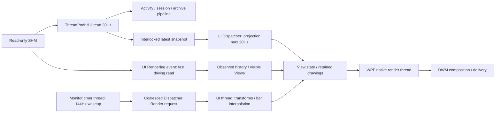

# Monitor 구조적 병목 개선 및 멀티코어 분석 — 2026-09-12

## 결과

**확인된 원인을 제품 코드에서 개선했으며, 통합 회귀와 3회 Before/After 교차 측정을 마쳤다. 최종 판정은 YELLOW다.** 하네스의 연속 애니메이션 전달 기준은 개선됐지만 실제 physical presentation FPS/실게임 부하와 native GPU POC의 동등 전달 계측은 미검증이다. CPU 감소 대신 Private/WS가 조금 증가한 trade-off가 있다. VR 미검증 자체를 Monitor YELLOW 이유로 삼지 않는다.

동일 조건 중앙값: CPU **5.243→3.121%**, allocation **78.922→8.396MiB/s**. CPU 약 40.5%, allocation 약 89.4% 감소했다. 개선 후 3회 모두 Avante/graph/pedal에서 >33ms 0회, 각 p95≤13.887ms였다. 이것은 DWM 전달 결과이며 물리 화면 60fps 완료 선언이 아니다.

## 기준선 및 작업 범위

- 먼저 확인한 문서: `2026-09-12-monitor-renderer-matrix.md`, AGENTS.md, PROJECT.md, docs/TASK.md와 실제 작업 트리.
- HEAD/main/v0.7.1: `85442a7c7b901907623aaecb55f4285d802e7692`, dirty 유지. 순정 태그로 되돌리지 않았으며 이전 Avante/UI/최적화 변경을 보존했다. 선택은 **Default WPF hardware / Monolith 유지**다.
- 이번 기준선: `work/monitor-structure/source-before`, `baseline.json`, `git-before.txt`, `product-before`. 기준 204개 파일과 실제 실행 DLL을 따로 보존했다.
- 이전 Gate B 5.975→4.215%와 65.466→69.336MiB/s는 당시 실행 결과다. 이번 동일 DLL Before는 DWM 전달률도 달라 CPU 5.230–5.435%였다. 다른 시점의 4.215%를 이번 After와 직접 빼서 개선율을 만들지 않았다.
- 제품 수정: AvanteClusterView, PedalCurveCache, DrivingHudViews, MonitorPresentationClock, HudTargetMotion 및 새 RetainedGeometry. 관련 기존 테스트 두 파일의 검증을 확장했다. 하네스와 작업 기록은 별도다.
- 보호한 Core/Runtime/Assets 110파일 해시 변경 0개. SHM/Session/Activity/Witness/Compact/Archive/Upload 계약·정밀도·순서·cadence 및 원본 이미지/폰트/설정 저장 변경 없음.
- 게임 조작/파일 수정/injection/hook/process-memory-write/network 변경, 설치 교체, commit/tag/push/release 없음.

## REQ-01 — 실행 구조와 스레드



| 구간 | 실제 코드/담당 | cadence·affinity·대기 |
|---|---|---|
| SHM full read | PlayerOverlayCoordinator.ReadTelemetry / ThreadPool timer | 33.333ms policy. `_telemetryGate` TryEnter로 기존 중복 tick 억제, `_readerGate` lock 안에서 TryRead. Activity Observe도 이 callback 경로. 이번 Collector 미실행으로 대기량 미계측 |
| Latest/model | Interlocked.Exchange `_latest`; UiTick / UI Dispatcher | UI timer 16ms tick, deadline으로 projection 최대20Hz. 최신 snapshot으로 표시 모델 생성. capture마다 Dispatcher queue를 추가하지 않음 |
| fast HUD read | DrivingFrame / UI Dispatcher의 CompositionTarget.Rendering | 서로 다른 RenderingTime마다 `_readerGate` TryEnter. UI에서 reader lock을 기다리지 않음. 성공 sample→UpdateDrivingSample→history→visible View. capture에 전달하지 않음 |
| View 갱신 | RefreshDrivingViews / UI Dispatcher | 활성 디자인·IsVisible·설정 opacity로 대상 제한. WPF 객체는 UI thread 전용. 이번 capture 경로 코드 변경 없음 |
| presentation clock | MonitorPresentationClock / native waitable timer thread | 144Hz는 표시 보간 전용. WPF 갱신은 Dispatcher에서 수행. pending을 병합하고 callback 종료까지 유지. UI의 동기 Invoke/worker 대기 없음 |
| native rendering | WPF CPartitionThread / render thread | path bounds/stroke/tessellation/driver command. WPF retained tree의 직렬 처리 잔존 |
| composition | DWM process | HWND의 UpdateWindow 이벤트 측정. 물리 화면 표시 완료와 구분 |

위 표의 코드 확인과 실제 trace 식별을 구분한다. **Collector는 이번 fixture에서 실행하지 않았으므로 Collector의 실제 스레드 ID/CPU/lock 대기 수치를 만들어내지 않는다.** 수집 policy는 그대로이고 fast HUD read가 기존 Rendering event에 종속된 구조도 그대로다. 따라서 화면이 빨라지면 관측되는 fast HUD 읽기 횟수는 달라질 수 있으나 full recording/upload cadence를 수정한 것은 아니다.

관리 주요 스레드는 이름으로 추측하지 않고 entry point의 `GetCurrentThreadId()`/managed thread ID 로그로 식별했다. Before PID17488/UI TID3400(managed1), After PID5236/UI TID10540(managed1). native render는 각각 TID20224/19224의 CPartitionThread stack으로 식별했다. 기타 작은 스레드는 역할이 증명되지 않은 경우 other로 남겼다.

| 별도 profile | 구간 | UI 실행 시간 | Render 실행 시간 | UI+Render 동시 실행 |
|---|---:|---:|---:|---:|
| Before | 30.492s | 12,175.875ms | 18,791.965ms | 5,928.106ms |
| After | 30.611s | 3,525.350ms | 16,028.174ms | 801.910ms |

CSwitch in/out에서 실행 시간을 적분했다. 여러 논리코어로 migration/동시 실행이 실제 관측됐다. 한 스레드는 동시에 여러 코어에서 실행하지 않으며 평균 CPU만으로 코어 포화를 단정하지 않았다. 동시 실행 시간이 줄었어도 총 작업량이 줄었으므로 이를 멀티코어 활용 퇴보로 해석하지 않는다.

Before render가 Ready 상태로 선점된 뒤 다시 실행되기까지 합계20.315ms/p95 0.048ms, UI는 합계1.235ms/p95 0.026ms였다. Wait 상태에서 다시 실행될 때까지의 구간은 blocked+일부 ready 지연이 섞인다. ReadyThread 이벤트를 수집하지 않았으므로 해당 구간을 모두 순수 lock 대기나 CPU 경쟁이라고 단정하지 않는다. 정상 비프로파일 최종 실행의 Dispatcher queue delay p95는 JSON에 별도 기록되어 있고 대규모 backlog의 증거는 없었다.

지연 구간도 trace를 겹쳐 확인했다. 예: Before pedal 전달 7639.990→7730.321ms(90.331ms) 동안 UI 실행88.743ms/render9.663ms, After graph 3490.701→3546.275ms(55.574ms) 동안 UI49.517ms/render4.689ms다. 두 실행시간은 중첩되므로 합산하면 안 된다. 이들은 **profiler가 붙은 실행**의 지연이며 최종 무프로파일 지연값으로 쓰지 않는다. 샘플 profiler의 SuspendOther 이벤트와 gc-verbose 부담도 존재한다. 최종 반복 실행에서는 이런 >33ms가 개선 후 관측되지 않았다.

### 병렬화 판단

독립 SHM/capture는 이미 background 경로이고 WPF UI/native render는 서로 다른 스레드다. 이번 주된 문제는 직렬 구간에서 반복되는 변환/경계/stroke 작업이었다. 이 WPF 객체들을 Task.Run으로 옮기는 것은 affinity 위반 또는 다시 Dispatcher로 돌아오는 비용을 만든다. 추가 bounded worker의 이익을 증명할 무거운 순수 계산이 이번 fixture에서 발견되지 않아 worker/thread/process/IPC를 추가하지 않았다. native waitable timer는 기존 공유 표시 시계를 유지한 것이며 CPU 분산 자체를 성과로 세지 않는다.

## REQ-02 — 원인 분리

동일 4개 HUD, 위치/크기, 10초 history, 3초 warmup, 각25초. 합성 입력60Hz와 상태표시20Hz를 유지했다. 하네스-only에는 창/자산을 만들지 않고 같은 Dispatcher 스케줄러만 실행한다. 모델-only는 추가 대조다. View 차단은 **4개 HUD를 유지하고 sample/history와 Timing 모델 갱신은 계속하되 SetSample/SetHistory/SetViewModel 전달만 차단**했다. 차단 구간에도 입력1499개가 처리됐다.

| 실행 | CPU % | WS MiB | Private MiB | Allocation MiB/s | GC 0/1/2 |
|---|---:|---:|---:|---:|---|
| 하네스만 | 0.004 | 49.816 | 20.078 | 0.102 | 0/0/0 |
| 모델/입력만 (추가 대조) | 0.012 | 50.414 | 20.586 | 0.116 | 0/0/0 |
| 정지 HUD 4개 | 0.008 | 158.988 | 106.406 | 0.105 | 0/0/0 |
| 모델 유지/View 갱신 차단 | 0.012 | 160.996 | 107.418 | 0.132 | 0/0/0 |
| 전체 애니메이션 | 5.842 | 209.359 | 228.191 | 79.253 | 43/7/1 |
| 문자/stroke 표시 제외 | 5.166 | 213.105 | 233.246 | 79.197 | 43/7/1 |
| 그래프 선만 표시 제외 | 3.339 | 208.547 | 228.246 | 79.228 | 43/7/1 |
| 바늘/효과 표시 제외 | 5.034 | 206.578 | 149.688 | 78.379 | 42/7/1 |

문자/stroke 제외는 `_values` 표시만 차단하므로 관리 측의 DrawValues 호출 비용은 남는다. 그래프-only 제외는 wheel을 유지하고 plot visual만 숨긴다. effects는 follower/motion/needle에 빈 clip을 고정해 렌더를 제외한다. 제품 기능을 삭제하지 않았다. 처음 opacity로 effects를 숨긴 실행은 DrawMotion이 opacity를 덮어쓰므로 제외 근거에서 폐기하고 persistent clip 실행으로 보완했다. 최초 graph panel 전체(휠 포함) 숨김 결과와 graph-only 결과도 구분해 보존했다.

정지/차단 surface의 DWM 이벤트가 없는 것은 0fps 실패가 아니다. 바뀐 내용이 없다. effects 제외 후 Avante 전달률이 낮아지는 것도 바늘 없이 값이 바뀌는 횟수만 남는 진단 효과다. 해당 저빈도 간격을 정상 연속 애니메이션의 stall과 섞지 않는다.

### 표시 시계 비교 — 입력 cadence와 분리

아래는 같은 65ms RPM/35ms 핸들 시간 기반 보간을 하네스에서 적용한 공통 표시 시계 비교다. 입력은 모두60Hz다. native 제품 Before/After와 별도 service-level 실험이다.

| 공통 표시 시계 | 입력 Hz | CPU % | Allocation MiB/s | Avante DWM Hz / p95 | Pedal DWM Hz / p95 |
|---|---:|---:|---:|---|---|
| 60Hz | 60 | 2.602 | 37.360 | 59.936 / 20.846ms | 43.372 / 34.727ms |
| 120Hz | 60 | 4.135 | 56.497 | 113.543 / 13.897ms | 60.010 / 20.850ms |
| 144Hz | 60 | 4.518 | 63.209 | 136.996 / 13.851ms | 60.010 / 27.769ms |

60Hz wakeup만으로 WPF/DWM 전달이 정확히60Hz로 정렬되지는 않았다. 페달 전달43.372Hz, Avante p95 20.846ms로 악화되어 단순 저주기 전환을 채택하지 않았다. **제품144Hz 시계는 유지했고 최종 개선율을 표시 빈도 감소로 만들지 않았다.**

### 충분한 관리 allocation trace

같은 `dotnet-sampled-thread-time,gc-verbose`, 각각 약30초. Before 21,936 allocation ticks/30.021s, After 2,402 ticks/30.004s, 양쪽 stack 연결100%, EventsLost=0. AllocationTick은 샘플링 추정이므로 GC.GetTotalAllocatedBytes의 최종 측정값과 구분한다.

| 할당 타입 | Before MiB/s | After MiB/s |
|---|---:|---:|
| 전체 추정 | 74.280 | 8.138 |
| System.Byte[] | 52.151 | 2.433 |
| System.Windows.Point[] | 4.429 | 0.278 |
| EffectiveValueEntry[] | 3.532 | 0.583 |
| ByteStreamGeometryContext | 1.937 | 0.440 |

최대 두 **서로 다른 allocation stack**은 PathGeometry.GetPathGeometryData→Geometry.GetBoundsInternal→DrawingGroup.WalkCurrentValue→UIElement.GetHitTestBounds→Visual.Precompute 경로의 ByteStreamGeometryContext.ReadWriteData(28.904MiB/s), ShrinkToFit(16.345MiB/s)였다. 문자도 GeometryGroup의 변환된 figure 병합 및 Avante.Status→DrawValues 경로가 관측됐다. native CPU 표본이나 짧은 trace에서 할당 원인을 추정한 것이 아니다.

프로파일 GC pause는 Before 48회/총2391.822ms, After 5회/총201.115ms였으나 profiler 영향이 크므로 정상 플레이 pause 예측에 사용하지 않는다. 최종 표의 GC count는 profiler 없는 별도 실행이다. 함수별 inclusive CPU는 중첩되므로 합산하지 않았다.

## 확인된 원인과 개선 — REQ-03

1. **Frozen PathGeometry도 WPF bounds walk에서 다시 직렬화됨.** 기존 chunk 재사용은 C# history 재순회를 막았지만 WPF 내부의 임시 byte/point 배열까지 제거하지 못했다. 새 RetainedGeometry는 불변 도형을 StreamGeometry의 인코딩된 명령으로 한 번 변환한다. 완료된 graph chunk는 stroke outline도 한 번 만들어 frozen filled StreamGeometry로 보관한다. 최신 open chunk만 기존 관측 데이터에서 갱신한다. reset/gap/stale 의미와 color 변경은 유지했다.
2. **속도 하나의 변경이 기어/상태까지 재구성.** Avante의 속도/기어를 별도 DrawingVisual로 나눴다. 같은 표시 문자열이면 그 레이어를 열지 않는다. 상태는 상태값이 바뀔 때만 갱신한다. 문자 geometry/bounds/shadow/rim outline을 함께 캐시하고 매 호출 GeometryGroup.Bounds 병합과 반복 stroke/widen을 제거했다. 원본 폰트/그라데이션/기울기/이미지 유지.
3. **페달이 다른 연속 animation과 달리 입력 도착 시 OnRender 전체 재구성.** 배경·막대 geometry·라벨을 보존하고 막대는 기존 공유 target follower로35ms 시간 보간한다. 숫자는 관측값을 그대로 표시하며 기록 sample은 바꾸지 않는다. 숫자가 같으면 라벨 재생성 생략. 이 변경으로 입력60Hz와 페달 화면 전달이 분리됐다.
4. **표시 예약/비활성 처리 경계.** 공유 clock의 pending은 callback이 끝날 때 해제하여 실행 중 다음 표시 작업이 누적되지 않도록 했다. owner뿐 아니라 조상 opacity0도 확인해 motion을 중지한다. 마지막 subscriber의 timer 중지/오래된 callback 무효화는 유지했다. OFF window/view/image 해제는 기존 coordinator 구조를 유지하고 회귀 검증했다.

이번에 전체 history 재생성, per-frame BitmapImage, 원본 PNG 교체, 새 collector worker, 기록 데이터 drop을 추가하지 않았다. settings/resize 시의 bounded 재구성과 glyph 최초 생성은 남으며 메모리와 CPU를 맞바꾸는 캐시 비용을 아래에 공개한다.

변경 파일(이번 기준선 대비):

- `src/AMS2LeagueClient/Presentation/AvanteClusterView.cs`
- `src/AMS2LeagueClient/Presentation/DrivingHudViews.cs`
- `src/AMS2LeagueClient/Presentation/HudTargetMotion.cs`
- `src/AMS2LeagueClient/Presentation/MonitorPresentationClock.cs`
- `src/AMS2LeagueClient/Presentation/PedalCurveCache.cs`
- `tests/AMS2LeagueClient.Tests/RenderRemediationTests.cs`
- `tests/AMS2LeagueClient.Tests/TelemetryPanelLayoutTests.cs`
- 새 `src/AMS2LeagueClient/Presentation/RetainedGeometry.cs`
- `harness/monitor-structure/` 및 PROJECT/TASK/이 보고서.

### 배제하지 못한 가설

실게임의 GPU 경합/VR compositor/전체 Client20Hz projection/Collector가 함께 실행될 때의 lock·GC·스케줄링 비용은 미측정이다. 모든 HUD 조합의 비용도 이번4개 fixture에서 일반화하지 않는다. 현재 근거로 코어 포화, GPU 부족 또는 collector가 frame drop의 주범이라고 단정할 수 없다.

## REQ-04 — 최소 직접 GPU POC

개선 후에도 native render CPU 표본15,729/20,164(약78%)가 남아 graph plot 영역434×106 하나를 추가 비교했다. 정적 grid/색상은 최초 생성하고, 동일60Hz 관측값에서 같은 smoothing/Bezier/chunk 경로를 native D2D로 만든다. 닫힌 chunk와 GPU geometry realization을 재사용하며 매144Hz frame에 WPF Drawing 번역/geometry 재생성을 하지 않는다. 최신 chunk는 데이터 갱신 때만 갱신한다. WPF 설정창/제품은 이 POC를 사용하지 않는다.

| 실행 | CPU % | WS MiB | Private MiB | Allocation MiB/s | GC 0/1/2 |
|---|---:|---:|---:|---:|---|
| 개선 WPF plot | 1.025 | 155.816 | 107.211 | 2.649 | 1/1/0 |
| 직접 D2D/DComp plot | 0.026 | 124.766 | 95.715 | 0.151 | 0/0/0 |

WPF plot DWM129.026Hz/p95 13.891ms/>33ms0. GPU는 동일 DWM UpdateWindow를 얻지 못했다. DXGI statistics 변경 poll은142.232Hz/p95 6.950ms/>33ms0이지만 unique polls4266와 PresentCount delta4316도 다르다. **두 지표를 동등 FPS로 비교하지 않는다.** 정적 native/glyph/line 생성 비용을 포함해 측정했지만 GPU engine 사용률은 이번 표에서 미수집이다. 따라서 총 GPU 자원 우위나 물리 presentation 우위를 확정하지 않았다.

동일 plot의 WPF/GPU 캡처에서 곡선·색상·그리드를 비교했다. 큰 CPU/할당 감소는 유망하지만 동등한 전달 계측과 실제 overlay 통합/입력 전달 검증 전에는 제품 채택하지 않는다. 기존 WPF Drawing→D2D adapter 결과를 native renderer의 한계로 해석하지 않았다. 새 프로세스/IPC 없음.

## 최종 동일 조건 Before/After — 3회 교차

실행 순서 Before→After를3회, 각3초warmup+30초 측정. 동일144Hz scheduler, 입력60Hz(각1799개), Timing20Hz, 같은4개 surface/크기/위치/history/원본자산. 각 실행 전 DLL SHA256 확인. 프로파일러 없음. ETW frame delivery만 수집했다. 주사율/입력/업로드 Hz를 혼용하지 않았다.

- Before `51072116B626F62F99F9B12E8301183AEF20FC04469ACDE887F0F8797123C524`
- After `9A125B9D57ABEF2F2DF1A4B3942E6F335FE5E4AD1E1069F821CCBFCFAB560593`

| 실행 | CPU % | WS MiB | Private MiB | Allocation MiB/s | GC 0/1/2 |
|---|---:|---:|---:|---:|---|
| 01before-P | 5.243 | 207.234 | 222.695 | 78.922 | 51/8/1 |
| 02after-P | 3.098 | 216.852 | 231.484 | 8.398 | 6/2/1 |
| 03before-P | 5.435 | 208.289 | 223.016 | 79.306 | 51/7/1 |
| 04after-P | 3.261 | 217.340 | 231.082 | 8.396 | 6/2/1 |
| 05before-P | 5.230 | 209.703 | 224.723 | 76.779 | 49/7/1 |
| 06after-P | 3.121 | 212.746 | 227.418 | 8.395 | 6/2/1 |

| 지표 | Before 중앙값 [최소–최대] | After 중앙값 [최소–최대] |
|---|---:|---:|
| cpuMachinePercent | 5.243 [5.230–5.435] | 3.121 [3.098–3.261] |
| workingSetMB | 208.289 [207.234–209.703] | 216.852 [212.746–217.340] |
| privateMB | 223.016 [222.695–224.723] | 231.082 [227.418–231.484] |
| allocationMBps | 78.922 [76.779–79.306] | 8.396 [8.395–8.398] |

CPU는 machine total 기준16논리코어 정규화, WS/Private는 실행 종료 snapshot(peak 아님), allocation은 생존 RAM이 아닌 할당/초다. 표는3자리 반올림하고 모든 원시 정밀도·표준편차는 `final/medians.json`에 보존했다. 하네스-only CPU를 기계적으로 빼서 제품 전체 CPU를 만들어내지 않았다. 이 하네스에는 매 표시 tick의 UpdateLayout 호출이 있으며, View가 있을 때의 상호작용 비용까지 headless 대조가 분리하는 것은 아니다. 실제 Client의 projection/Collector 포함 성능으로 일반화하지 않는다.

| 실행 | HUD | DWM 전달 Hz | p95 ms | p99 ms | >33ms |
|---|---|---:|---:|---:|---:|
| 01before-P | avante | 141.566 | 6.969 | 13.886 | 0 |
| 01before-P | graph | 143.066 | 6.969 | 7.023 | 0 |
| 01before-P | pedal | 59.975 | 27.762 | 27.791 | 1 |
| 01before-P | timing | 20.004 | 55.574 | 62.501 | 599 |
| 02after-P | avante | 142.165 | 6.980 | 13.865 | 0 |
| 02after-P | graph | 142.699 | 6.975 | 7.080 | 0 |
| 02after-P | pedal | 142.532 | 6.977 | 7.228 | 0 |
| 02after-P | timing | 20.004 | 55.566 | 55.596 | 599 |
| 03before-P | avante | 133.000 | 13.882 | 13.900 | 0 |
| 03before-P | graph | 136.833 | 13.860 | 13.906 | 0 |
| 03before-P | pedal | 59.975 | 27.753 | 27.793 | 3 |
| 03before-P | timing | 20.004 | 55.597 | 62.507 | 599 |
| 04after-P | avante | 141.700 | 6.975 | 13.885 | 0 |
| 04after-P | graph | 142.433 | 6.971 | 13.816 | 0 |
| 04after-P | pedal | 142.466 | 6.977 | 7.478 | 0 |
| 04after-P | timing | 19.999 | 55.566 | 55.581 | 599 |
| 05before-P | avante | 137.333 | 7.012 | 13.894 | 0 |
| 05before-P | graph | 139.566 | 6.980 | 13.896 | 0 |
| 05before-P | pedal | 59.994 | 20.862 | 27.781 | 0 |
| 05before-P | timing | 19.999 | 55.570 | 62.483 | 599 |
| 06after-P | avante | 132.895 | 13.875 | 13.900 | 0 |
| 06after-P | graph | 132.528 | 13.884 | 13.906 | 0 |
| 06after-P | pedal | 131.828 | 13.886 | 13.914 | 0 |
| 06after-P | timing | 20.004 | 55.572 | 62.502 | 599 |

Timing은 의도적인20Hz 상태 표시이므로 약50ms 간격/599회 >33ms를 연속 애니메이션 실패로 세지 않는다. 나머지 세 surface는60Hz의16.67ms 예산과 비교했다. After 모든 p95/p99는16.67ms 이내였고 >33ms0이지만 일부 최대 간격은20.8ms였다. 세 번째 After의 DWM 전달률은 앞선 두 번보다 낮았다. 평균/중앙값만으로 이런 변동을 감추지 않는다.

## 회귀 및 외형

최종 `harness/reports/verify-20260912-121719.md`:

```text
GATE: PASS (59.1s)
versions PASS 0.7.1
secrets PASS
restore PASS
build errors=0 warnings=0
Client exit=0 passed=149 total=149 failed=0
Activity exit=0 passed=111 total=111 failed=0
```

Compiled geometry의 transform/contour/hole/area, 독립 speed layer/동일 문자열 생략, 페달 관측값 보존/숨김 후 follower 중지, last-subscriber clock 해제를 검증했다. 기존 glyph8개/막대8개/폰트Bounds·area 검증을 유지했다. OFF lifetime 회귀: options14/cycles2/auxiliaryRemaining0/Avante view+image collected3. Compact V1/V2/Wire 및 capture 관련 기존 계약 회귀도 통과했다. 보호 해시는 수정이 없다는 근거이며 실서버 전송 E2E를 실행했다는 뜻은 아니다.

첫 통합 실행은147/149였다. 새 테스트에서 Geometry.Parse의 frozen 결과를 직접 수정했고, 기존 라벨 테스트가 새 자식 DrawingVisual을 탐색하지 못했다. fixture를Clone하고 자식 drawing까지 탐색하도록 수정했다. 라벨 수/폰트 면적/막대 수 검증은 제거하지 않았다. 다음 통합 실행149/149로 통과했다. 미세 patch마다 전체 검증하지 않았고, 실패 통합 게이트를 해결하기 위한 재검증만 수행했다.

정지 동일 sample의 Before/After Avante/graph/pedal PNG를 직접 확인했다. 디자인/색상/문자 위치/기울기/폰트/바늘 배치 보존을 확인했고 animation은 정지 이미지로 판정하지 않고 위 ETW로 별도 확인했다. 실게임/물리 화면 계측은 수행하지 않았다.

## 증거 경로와 재현

- 코드/재현 설명: `harness/monitor-structure/README.md`.
- Gitignored 요약/이미지/로그/해시: `harness/reports/monitor-structure-20260912/`.
- 원본 대형 ETL/nettrace/JSONL와 기준선 바이너리: `C:/Users/User/Documents/Codex/2026-09-08/plugin-computer-use-openai-bundled-play-2/work/monitor-structure/` 아래 `isolation-1`, `isolation-followup`, `profile-before`, `profile-after`, `poc`, `final`.
- 실패한 초기 ETW 권한 시도와 초기 diagnostic/effect 오류 출력은 보존했다. 프레임 reader Debug binary는 START를 출력하지 않아 Release reader로 동일ETL을 다시 파싱했다. native symbol parser의 stderr로 shell exit1이 반환된 기록도 보존했고 JSON 완료/EventsLost0을 별도로 확인했다. 이것을 exit0으로 보고하지 않았다.
- POC 직후 공유 harness 출력에 현재 DLL이 들어간 것을 발견했다. POC effectClip은 After 보조자료로만 분류하고, 최종 Before/After는 별도before-bin/after-bin 복사와 해시 guard로 고정했다. 기본 source/product-before는 훼손되지 않았다. 보완 baseline effects/graph/blocked 실행도 별도 진단 binary에 원본 DLL을 명시 복사했다.

공식 근거: [WPF thread affinity/Dispatcher](https://learn.microsoft.com/en-us/dotnet/desktop/wpf/advanced/threading-model), [WPF render thread](https://learn.microsoft.com/en-us/troubleshoot/developer/dotnet/framework/general/wpf-render-thread-failures), [TraceEvent stack/ETLX](https://github.com/microsoft/perfview/blob/main/documentation/TraceEvent/TraceEventProgrammersGuide.md), [DXGI frame-statistics 제한](https://learn.microsoft.com/en-us/windows/win32/api/dxgi/nf-dxgi-idxgiswapchain-getframestatistics).

## 최종 판정과 다음 한 가지

**YELLOW — 코드 개선/기능 회귀/하네스 CPU·할당·전달 개선은 확인, 실게임 physical FPS와 전체 GPU 자원 우위는 미확정.** Private/WS 소폭 증가와 아직 약3.12%의CPU를 숨기지 않는다. Public Monitor/Public VR/League Collector는 장기 방향만 유지하고 이번 제품을 분리하지 않았다.

VR: 동작 보존을 위한 코드/회귀 검토만. Quest3/Virtual Desktop/실제SteamVR headset rendering **NOT TESTED / OUT OF SCOPE**. VR PASS 선언 없음.

다음 작업 하나: **직접 GPU graph POC와 WPF graph에 공통으로 적용할 composition/presentation 계측을 확보해, graph surface 하나의 제품 채택 여부를 판정한다.** 동일 plot에서CPU1.025→0.026%,allocation2.649→0.151MiB/s로 가능성이 확인됐지만 현재 관측 지점이 달라 채택 조건이 아직 충족되지 않았다. 전체 renderer/프로세스 분리부터 시작할 근거는 없다.

최종 배치 후 저장소 하네스 재현 build: 경고0/오류0, 3.08s. 새 하네스를 포함한 secret check: scanned=380 allowed=37 hits=0, PASS. 제품 DLL SHA256은 최종 교차 측정의 After와 동일함을 재확인했다.
