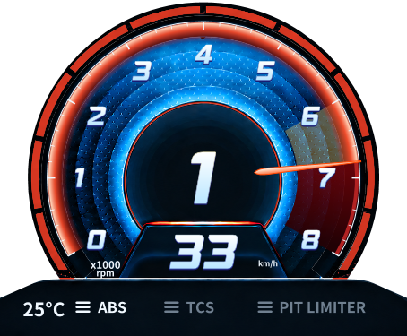

# RPM 자동 최대 눈금의 1000RPM 여유 수정 — 2026-09-13

## 원인과 범위

공개0.7.2/HEAD `760343a`의 공통 함수는 `(floor(redStart/1000)+1)*1000`이었다. 따라서 빨강6800에서 최대7000만 표시됐다. 앞선14800→16000은 Lola의 수동 최대값으로 적용됐고, 최소1000RPM 여유가 공통 자동 정책에 반영되지 않았다. 릴리즈 패키지가 이전 DLL로 바뀐 문제가 아니라, 소스에 남은 범위 결정 정책과 누락된6800 회귀 사례가 원인이다.

REQ-N-HEADROOM-11에 따라 **`ceil((redStart+1000)/1000)*1000`**으로 수정했다. 자동 최대를 사용하는 일반형·확장형과 기존 설정창이 모두 동일 함수를 호출한다. 수동 최대값을 지정한 경우는 그대로 우선한다. 노랑90%/빨강97% 경계, 원본 RPM, 레드존 기준200ms 점멸·외곽5쌍 완등, 폰트·자산·정적 렌더 구조는 변경하지 않았다.

|레드존 시작|이전 자동 최대|수정 자동 최대|
|---:|---:|---:|
|6800|7000|8000|
|6999.99|7000|8000|
|7000|8000|8000|
|7000.01|8000|9000|
|7400|8000|9000|
|8400|9000|10000|
|10500|11000|12000|
|14800|15000|16000|

기존 공통 정책 fixture의 엔진7600/10000/11500/16000은 노랑·빨강 시작값이 그대로이며, 자동 최대만9000/11000/13000/17000으로 바뀐다. 이는 빨강 위 최소1000RPM 여유를 모든 차량에 동일 적용한 결과다.

## 변경 파일과 검증

- 제품: `src/AMS2LeagueClient.Core/Presentation/AvanteRpmScale.cs`의 공통 최대 함수와 설명 주석만 변경.
- 기존 `AvanteRpmCalibrationTests.cs`:6800·천 단위 경계·14800 자동/수동 전환과 일반/확장 캡처 확대, 새 최대에 맞춘 숫자 개수/좌표 기대값 갱신.
- 기존 `AvanteCommonRpmPolicyTests.cs`: 공통90/97 임계값은 유지하고 최대값과 설정 해제 기대값 갱신.
- `docs/TASK.md`, `PROJECT.md`, 본 보고서 및 WPF 증거. 이전 공개 릴리즈 기록은 이력으로 보존한다.

시작 작업 트리는 깨끗했고 기준선/소스 hash는 작업 공간 `work/rpm-headroom/before/`, `baseline-hashes.json`, `baseline.log`에 보존했다. 기준선은 Client158/158·Activity111/111·빌드 경고/오류0.

최종 동일 DLL 전체 실행은 **Client158/158, Activity111/111**, 빌드 경고/오류0. 기존 테스트 수를 유지하고 사례를 추가했으며 삭제/skip하지 않았다. WPF 캡처를 포함한 관련 단독 검사는1/1 PASS. RPM 갱신 시 정적 face 재생성0, resolver100000회 관리 allocation0도 확인했다. 이는 실게임 총 CPU/할당 성능 측정은 아니다.

초기 실행에서 새 최대13에 따른 숫자14개 기대값 누락과 새14800 fixture의 무효 수동 최대12000을 발견했다. 각각 정확한 개수와 유효한 수동값20000으로 수정해 검증을 유지했다. 그다음 전체 실행에서 변경하지 않은 Race batch 검사가1회 실패했고, 단독1/1 및 전체 재실행158/158은 통과했다. 해당 실패의 원인은 확정하지 않았고 로그를 보존했다. 최종 성공으로 최초 실패를 감추지 않는다.

로그: `first-verification-failed.log`, `related-errors.log`, `final.log`, `race-batch.log`, `full-recheck.log`, `full-recheck-errors.log`, `activity-final.log`, `capture.log`. canonical verify.ps1의 오류 출력 중단 후, 최종 전체 재확인은 동일 DLL을 직접 실행해 stdout/stderr를 모두 보존했다. 제품·테스트 scoped diff-check PASS.

## 실제 WPF 캡처

합성 fixture이며 실게임 캡처가 아니다. 노랑 시작6000은 경계 보존 검사용 명시적 보정값이다. 특히14800 그림의 넓은 노랑 영역을 공통90% 정책으로 해석하지 않는다. 아래6800 사례는 숫자0~8,6.8 위치의 바늘/빨간 배경 시작, 외곽5쌍 완등을 보여준다. 확장형 및14800→16000도 별도 PNG로 저장하고 확인했다.

## 별도 검증 빌드 / 남은 제한

- 별도 실행 파일은 작업 공간 `work/rpm-headroom/test-build/client/AMS2LeagueClient.exe`에 준비했다. 이번에는 실행 중인 프로그램을 전환하지 않았다.
- Client SHA256:`AD3235E2C68344D4A77F95CB06D90A8D05E292ABF61352D87466623BD66044C9`.
- Core SHA256:`9D0EB5BD8B6692BE17D1F099F14A379A907F928C3B3C2369E00183CFC3BC095C`.
- 버전은0.7.2를 유지한 **미배포 검증본**이며 기존 공개0.7.2 자산/태그/설치본은 변경하지 않았다. commit/tag/push/release 없음.
- 실게임·새 성능 비교·VR은NOT TESTED. 기존 Monitor RED 유지.
- 다음 작업 한 가지: 별도 검증본에서 사용 중인 차량의 자동 눈금과 실제 레드존 여유를 확인한다. 코드·WPF 검증은 실제 차량 표시 수용을 대신하지 않는다.
