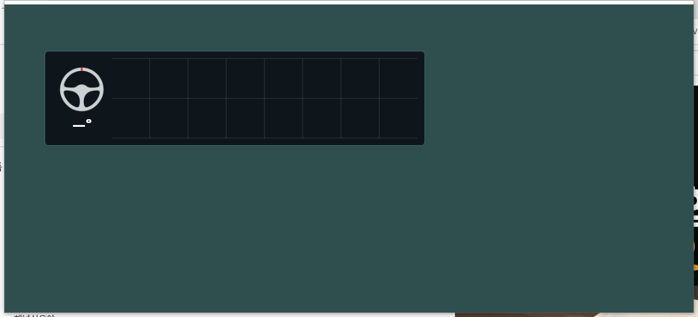
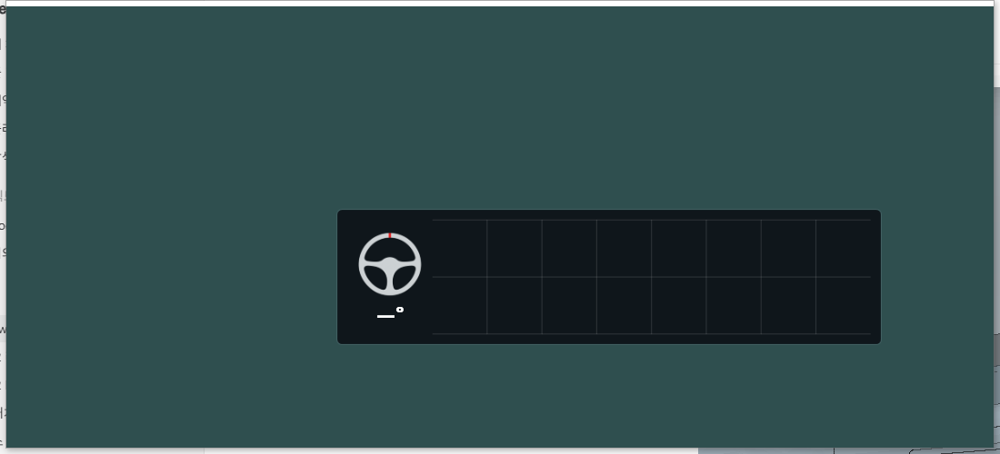
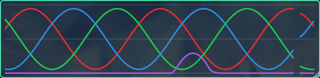

# v0.7.4 — 트리플 모니터 UI 배치 개선

## 기준선과 범위

- 사용자 승인: “현재 상태가 트리플 모니터 관련 개선은 된거라면 0.7.4로 릴리즈”. 개선사항: **트리플 모니터 사용시 UI 배치 관련 사항 개선**.
- 기준선: 공개 v0.7.3/main `86a729198a63aef265dba010ef6113b4771d8df5`.
- 기존 개발 트리의 GPU/DComp·offline replay·성능 실험은 출하하지 않는다. v0.7.3 독립 checkout에 배치 수정만 추출했다. 원본 개발 트리 HEAD와 미커밋/미추적 78개 파일은 유지하고 SHA256 일치를 확인했다.
- 원본 백업 `work/release-0.7.4/start-snapshot.zip`: `ec91032d99cdfaa116ecd38e007bba292d35f214aca11225578362aad46f8a87`.
- 원본 개발 저장소는 이전 HEAD에 남는다. 이후 개발 시 이 릴리즈의 배치 변경과 버전 메타데이터를 검토해 통합해야 하며 dirty tree에 무조건 pull/reset하지 않는다.
- N RPM 정책·눈금·폰트·이미지·렌더러·SHM/기록/archive/upload 계약은 v0.7.3 그대로다. 기본 하드웨어 WPF 유지. 게임/설치본/서버 변경 없음.

## REQ-RELEASE-074 수용 결과

배치 수정과 로컬 릴리즈 게이트 PASS. 물리 트리플 및 혼합 DPI 검증은 NOT TESTED다. 논리 구성 fixture와 실제 듀얼 모니터 검증을 구분한다.

| 항목 | 수정 전 | v0.7.4 후보 |
|---|---|---|
| 게임 기준점 이동 후 WPF 실제 위치 | X -300px / Y -150px 오차 | 양 축 0px |
| viewport 밖 위치 저장 | (-500,-300)이 (0,0)으로 제한됨 | (-500,-300) 보존 |
| 실제 드래그 | 별도 수정 전 측정 없음 | +123,+57 physical pixels 반영 |
| 저장 후 새 프로세스 2회 복원 | 별도 수정 전 측정 없음 | (323,237,650,160) 동일, 누적 오차 0px |
| 실제 연결 모니터 2개, 총10회 이동 | 이전 개발 보고서와 별도 측정 | 위치·크기 오차 0px |
| 논리 single/dual/triple 좌표 fixture | 기존 회귀에 없음 | 1080p/1440p/4K, 100/125/150/200%, 좌/우/상단/세로/비대칭, spanning, 25회 직렬화/복원 통과 |

실제 두 모니터의 bounds·DPI·실행별 위치는 [측정 JSON](evidence/2026-09-14-release-0.7.4/package-proof.json)에 기록했다. fixture의 배율 계산은 실제 mixed-DPI OS 동작 검증이 아니다.

## 변경 파일과 좌표 의미

- `src/AMS2LeagueClient.Core/Presentation/OverlayLayoutProfile.cs`: 게임 client 크기로 normalized 저장하되 새 편집 위치는 음수/viewport 밖을 허용. 기존 schema1 파일은 종전 clamp 호환. 게임 없는 편집의 physical client 기준점·크기·DPI 저장.
- `src/AMS2LeagueClient.Core/Presentation/OverlayScreenPlacement.cs`: 가상 데스크톱 physical pixels에서 실제 monitor bounds와 교차하는지 확인. 접근 불가 창만 가까운 work area로 임시 복구. bounding rectangle 안 빈 영역을 화면으로 취급하지 않음.
- `src/AMS2LeagueClient/Overlay/OverlayWindowInterop.cs`: Windows monitor bounds/work area/device 정보 캐시. display/settings/DPI 이벤트 때 무효화. 매 프레임 모니터 열거하지 않음. 초기 preview 기준은 작업표시줄을 제외하지 않은 monitor bounds.
- `src/AMS2LeagueClient/Overlay/OverlayWindow.xaml.cs`: 배치 캐시 키에 게임 client 원점/크기/DPI/display revision 포함. 임시 복구 위치를 원래 저장값으로 덮어쓰지 않음. 저장한 편집 기준점 복원.
- `src/AMS2LeagueClient/Overlay/OverlayWindow.Vr.cs`: desktop 임시 복구가 별도 VR compositor의 원본 배치까지 옮기지 않도록 보존. VR 실기기 NOT TESTED.
- `tests/AMS2LeagueClient.Tests/MonitorPlacementTests.cs`, `Program.cs`: 논리 배치·음수 좌표·저장/복원·화면 공백·제거/복원 fixture 추가. 기존 검증 삭제/완화 없음.
- `harness/monitor-placement/`: 기존 placement POC의 WPF 검증 부분만 재사용. 제품에 renderer/IPC/replay 옵션 추가 없음. 별도 설정으로 실제 HWND/드래그/프로세스 재시작 측정.
- 버전/문서: `Directory.Build.props`, `ClientStatusViewModel.cs`, `README.md`, `VERSIONING.md`, `CHANGELOG.md`, `PROJECT.md`, `docs/TASK.md`, `scripts/build-release.ps1`, `installer/AMS2LeagueOverlay.iss`, `release/README_KO.txt`, `release/RELEASE_NOTES_KO.md`.

모니터 열거 순서를 저장된 대상 ID로 쓰지 않는다. 기존 게임-client normalized 배치 정책을 유지하므로 임의 모니터 재배열을 영구 ID로 추종하는 새 기능은 추가하지 않았다. 물리 hotplug/주 모니터 변경/VR 실험은 미실시.

## 검증 로그와 패키지

작업 루트의 `work/release-0.7.4/` 아래에 로그를 보존했다.

- `baseline.log`: v0.7.3 `verify.sh`, Client158/158, Activity111/111, warning/error0.
- `verify.log`: 후보 `verify.sh -CaptureLayouts`, Client159/159, Activity111/111, warning/error0.
- `build-release.log`: 최종 공식 build-release, Client159/159, Activity111/111, warning/error0. 폴더/ZIP/설치 EXE 공개 패키지 감사 모두 PASS, forbidden0.
- `placement-after.log`: 첫 비승격 실행의 화면 캡처가 `Graphics.CopyFromScreen` invalid handle(6)로 실패. 이를 제품 배치 PASS로 세지 않았다. 사용자가 본 `placement.exe` 오류 창도 이 검증 실패였다. 검증 도구 최상위 예외를 기록하고 exit1로 종료하도록 수정했다.
- `placement-after-r2.log`, `placement-physical.log`: 실제 데스크톱 접근이 가능한 실행에서 재검증 PASS. 제품에는 캡처 코드를 추가하지 않았다.
- `placement-session-1/2/3.log`: 별도 프로세스 실제 드래그/저장/복원 PASS. 전용 입력 대상 HWND를 hit-test로 확인한 뒤 bounded drag만 수행.
- `placement-build-final.log`: WPF harness warning/error0.
- `versions.log`: VERSION CHECK PASS.
- `isolated-update.log`: 공개 v0.7.3 ZIP에서 실제 updater helper와 설치 EXE로 격리 업데이트, exit0. 사용자 sentinel 보존, 재시작 캡처18개, EXCEPTION0. 게임 미실행. 실제 설치본 교체 없음.
- `package-proof.json`: 격리 업데이트 후 배포 파일470개 SHA256 전부 일치, 기존 개발 파일78개/설치 DLL 해시 보존.

| 자산 | SHA256 |
|---|---|
| AMS2-League-Overlay-0.7.4-win-x64.zip | `84093a34f173adf6fee0fdb6a3cc9dbccd3c2a9779a1441998e1cee08d77d6ad` |
| AMS2-League-Overlay-0.7.4-Setup.exe | `0c94edae0730a8910f89473c83a46acbca04f9435bc1f0b36e24f6189c0c36da` |
| AMS2LeagueClient.dll | `b4959df504abe35885d36c0f026273a52ddc1179ee1c5abb753609f3b1e09490` |
| AMS2LeagueClient.Core.dll | `cd497a60193284e817a58994e6aa6abe7b4b6f07010070449844836a6fb9dfae` |

별도 체크아웃 `work/release-0.7.4/repo`에서 commit/tag/push하고 CI를 검증한 뒤 [v0.7.4](https://github.com/choi3724/AMS2KRLeague/releases/tag/v0.7.4)를 게시한다. 게시 성공 여부·CI URL·공개 다운로드 해시의 최종 증거는 작업 루트 `work/release-0.7.4/published-verification.json`에 기록한다. 이 문서 자체는 게시 전 검증 결과다.

## 남은 제한

- 기존 전체 Monitor 성능 **RED 유지**. 프레임 끊김 해결이나60fps 달성을 주장하지 않는다.
- 실제 트리플, mixed-DPI, 물리 모니터 hotplug, 실게임, VR, 장시간 수집, 운영 업로드: **NOT TESTED**.
- 재부팅 후 사용자에게 부하가 여전히 관측됨. 부하 실험/GPU 작업은 별도 개발 트리에 보존하며 이번 릴리즈에 포함하지 않음.
- 요청하지 않은 UI 디자인 변경 0건. 운영 서버/게임/시스템 디스플레이 설정/설치본 변경 0건. 공개 릴리즈는 이번 사용자 승인 범위다.
