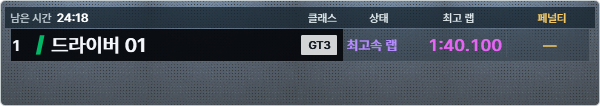
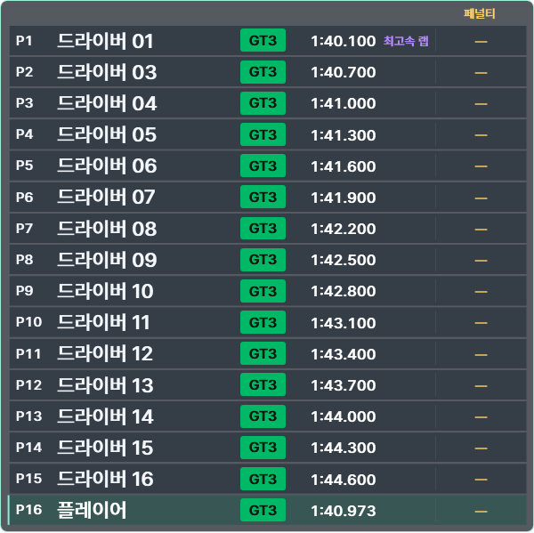

# v0.7.5 — 편집·저장한 HUD 크기 유지

## 기준선과 범위

사용자의 “다음 버전으로 커밋 및 릴리즈” 승인에 따라 공개0.7.4/main `ad39c1e100ee6622e83e622dd3b187d38392afe2`에서 독립 릴리즈 체크아웃을 만들었다. 기존 분석 트리의 HUD 크기 수정만 추출했다. 미채택 DComp/전체 HUD/오프라인 replay/성능 진단 변경은 포함하지 않는다.

기준선 Client159/159, Activity111/111, 빌드 warning0/error0. 릴리즈는 Client162/162(관련3검사 추가), Activity111/111이다. 분석 트리의163개에는 공개 제품에 없는 재생 검사가 포함되므로 시험 수 차이를 검증 삭제로 해석하지 않는다.

## REQ-RELEASE-075 변경과 수용

같은 트리플 장비에서도 게임 없는 편집 기준은 설정 창이 있는 한 모니터 또는 저장된 PreviewViewport이고, 게임 표시는 전체 game client 영역을 사용할 수 있었다. 이전 크기 계산은 저장된 비율에 현재 게임 영역을 곱해600px가1800px로 커졌다. 순위표 Viewbox 확대율까지 커지는 경로를 수정했다.

- `OverlayLayoutProfile.cs`: HUD별 `ReferenceWidth/ReferenceHeight`로 저장 당시 physical pixel 크기 복원. 위치의 기존 normalized 게임 기준, 화면 복구, 크기 제한 유지.
- `OverlayLayoutStore.cs`: 기존 PreviewViewport로 누락된 크기 기준 보완. 첫 변경 저장 전 `.before-fixed-size.bak` 원본 보존. Load 자체는 파일을 다시 쓰지 않음.
- `OverlaySizeTests.cs`, `Program.cs`: 14개 HUD 크기, 해상도 기준 변화, 부분 편집, 숨겨진 HUD, 호환/백업, 실제 WPF 편집/저장/새 창 복원과 행 전환 검사.
- 버전·릴리즈 문서·기본 표시 버전만0.7.5로 변경. N 계기판·폰트·이미지·RPM·수집·기록·전송 계약과 기본 WPF hardware 경로 유지.

| WPF 창 검증 | 수정 전 | 0.7.5 |
| --- | --- | --- |
| 편집2560→게임7680, 저장 폭600 | 폭1800, 확대율2.777778, 요청16행 중5행 표시 | 폭600, 확대율0.925926,16행 표시 |
| 편집7680→게임7680 | 인원 변화만으로 폭 확대되지 않음 | 폭600 유지 |
| 두 순위표 디자인 각각16→1→16→1 | 행 변화만의 별도 결함은 미재현 | 폭600, 글자 확대율 유지; 높이만599↔106 |
| 일부 HUD만 다른 기준 영역에서 재편집 | 전역 기준에 따라 다른 HUD 크기가 달라질 수 있음 | 숨긴 HUD 기준과 저장 크기 보존 |

기존 설정에 크기 기준과 PreviewViewport가 모두 없으면 원래 크기를 임의 추정하지 않는다. 재편집한 HUD부터 새 크기 기준이 저장된다. 이미 잘못 확대된 크기를 사용자가 저장한 경우 의도한 이전 크기는 자동 복원할 수 없다.

WPF 캡처는 실제 테스트 창 렌더 결과다.7680 game client는 fixture이므로 사용자의 물리 트리플·혼합 DPI·실게임 검증을 대체하지 않는다. 이번 릴리즈는 프레임 지연 해결 릴리즈가 아니며 Monitor RED 유지.

## 릴리즈 게이트

작업 로그는 독립 작업 루트 `work/release-0.7.5/`에 보존한다. 최종 패키지/업데이트 검증은 [기계 판독 증거](evidence/2026-09-15-release-0.7.5/package-proof.json)에 기록한다.

- 공개0.7.4 기준선: `baseline.log`, verify.sh와 동일한 verify.ps1 실행,159/159·111/111.
- 공식0.7.5 build-release: `build-release.log`,162/162·111/111, warning0/error0.
- 관련 실제 WPF 검사: `layout-check.log`,3/3. 두 디자인·두 기준 폭·각4행 전환, 실제 HWND 폭과 확대율 비교.
- 최종 self-contained 배포의 Client/Core DLL을 같은 테스트 harness에 넣은 `package-layout-check.log`도3/3 PASS. 배포 DLL 해시는 기계 판독 증거에 기록.
- 설치 EXE·Portable ZIP·SHA256SUMS·release manifest 생성, 폴더/ZIP/EXE 공개 패키지 감사.
- 격리0.7.4→0.7.5 업데이트·자동 재시작·캡처18개·사용자 파일 보존, 배포 파일 전체 해시 비교.
- 원본 저장소와 분석 트리의 기존 dirty 파일 및 기존 설치본 DLL 해시 보존. 설치본 자동 교체나 운영 업로드 없음.
- GitHub CI와 Latest/공개4자산 다운로드 해시는 게시 후 `published-verification.json`에 기록한다. 게시 전 로컬 검증을 CI 완료로 간주하지 않는다.

물리 트리플/mixed-DPI/실게임/VR NOT TESTED. 프레임 성능 개선 판정은 하지 않았다.
